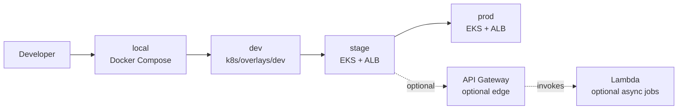
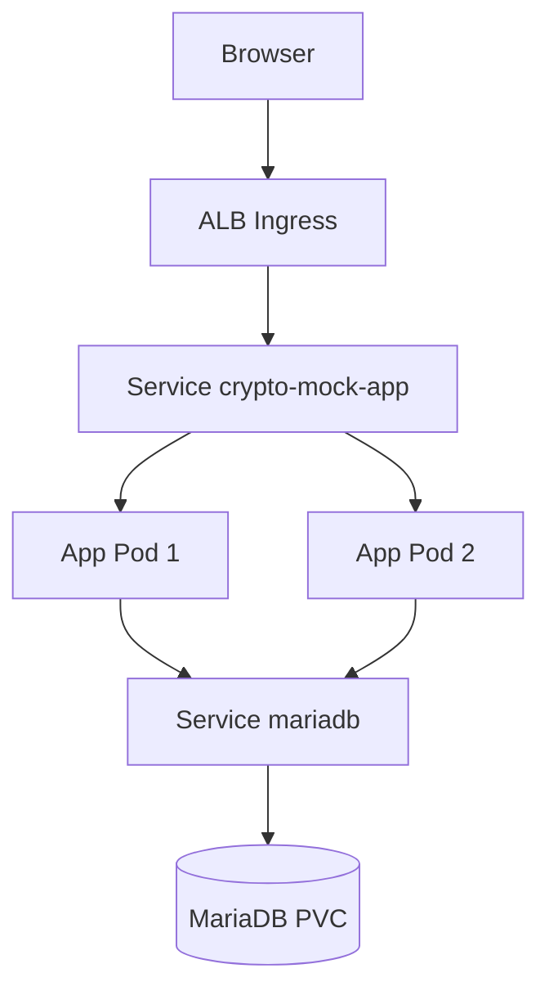
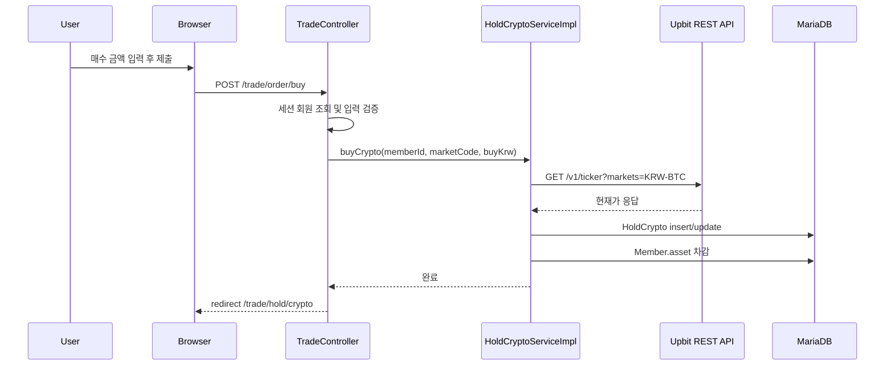
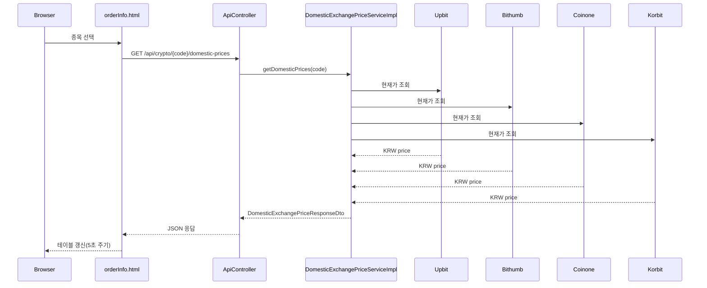
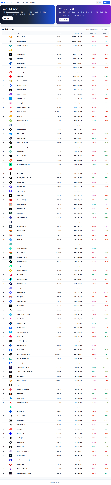
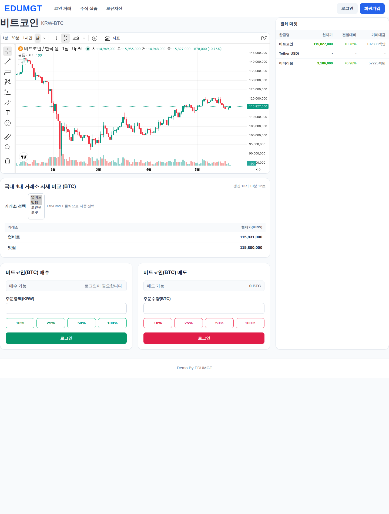
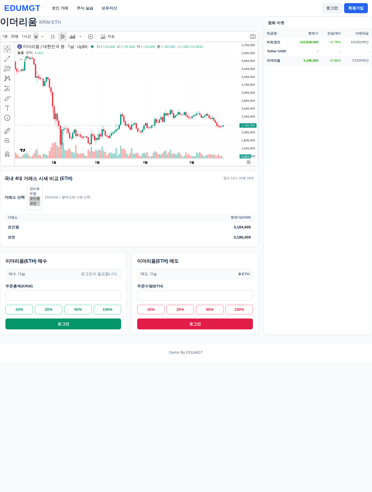
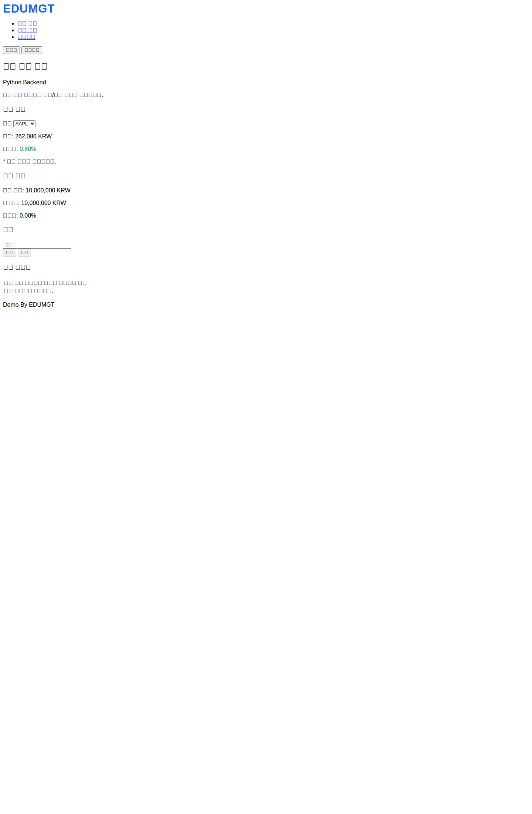

# 한국 4대 코인 거래소 시세 현황 출력 Web APP
 
### test

Spring Boot + Thymeleaf 기반의 가상 암호화폐 모의투자 웹 애플리케이션입니다.  
거래 화면에서 국내 4대 거래소(업비트/빗썸/코인원/코빗) 시세를 동시에 확인할 수 있고, UI는 Tailwind CSS 기반으로 구성되어 있습니다.

---

## 1) 주요 기능

- Tailwind 기반 반응형 UI
- 회원가입/로그인(세션 + BCrypt)
- KRW 마켓 기준 코인 모의 매수/매도
- 주식 거래 실습 화면(파이썬 기반 백엔드 연동)
- 보유자산(평가금액/수익률) 실시간 계산
- 업비트 WebSocket 실시간 시세
- 국내 4대 거래소 시세 비교 API (`/api/crypto/{code}/domestic-prices`)
- Docker / Kubernetes / Amazon EKS 배포 구성 (DB 포함)

---

## 2) 테스트 로그인 계정

앱 시작 시 아래 계정이 없으면 자동 생성됩니다.

- `test1@test.com / 123456`
- `test2@test.com / 123456`

---

## 3) 기술 스택

- Backend: Java 17+, Spring Boot 3.1.2, Spring MVC, Spring Data JPA
- Frontend: Thymeleaf, Tailwind CSS, JavaScript
- Security: BCrypt + Session
- DB: MariaDB
- Infra: Docker, Docker Compose, Kubernetes, Amazon EKS
- External API:
  - Upbit REST/WebSocket
  - Bithumb REST
  - Coinone REST
  - Korbit REST
  - CoinMarketCap REST

---

## 4) 저장소 분석 요약

이 저장소는 단순한 정적 데모가 아니라, 서버 렌더링 UI와 세션 인증, DB 트랜잭션, 외부 시세 API 연동을 한 프로젝트 안에서 처리하는 Spring Boot 모놀리식 애플리케이션입니다.

| 영역 | 실제 파일 | 역할 |
| --- | --- | --- |
| 메인 화면/회원 | `src/main/java/site/bitrun/cryptocurrency/controller/BasicController.java` | 메인 페이지, 회원가입, 로그인, 로그아웃 |
| 거래 | `src/main/java/site/bitrun/cryptocurrency/controller/TradeController.java` | `/trade/order`, 매수, 매도, 보유자산 화면 |
| 시세 API | `src/main/java/site/bitrun/cryptocurrency/controller/api/ApiController.java` | 개별 코인 정보, 국내 4대 거래소 시세 비교 API |
| 주문 처리 | `src/main/java/site/bitrun/cryptocurrency/service/HoldCryptoServiceImpl.java` | Upbit 현재가 조회 후 매수/매도, 보유 KRW 갱신 |
| 거래소 비교 | `src/main/java/site/bitrun/cryptocurrency/global/api/domestic/service/DomesticExchangePriceServiceImpl.java` | 업비트/빗썸/코인원/코빗 가격 집계 |
| 실시간 UI | `src/main/resources/static/js/order.js` | Upbit WebSocket 구독, 주문 비율 버튼 처리 |
| 거래 화면 | `src/main/resources/templates/trade/order.html`, `src/main/resources/templates/trade/orderInfo.html` | 차트, 시세 테이블, 매수/매도 폼 |
| 인증 | `src/main/java/site/bitrun/cryptocurrency/WebSecurityConfig.java`, `src/main/java/site/bitrun/cryptocurrency/interceptor/LoginCheckInterceptor.java` | BCrypt, 세션 인증 검사 |
| 로컬 배포 | `docker-compose.yml`, `Dockerfile` | 앱 + MariaDB 로컬 실행 |
| k8s/EKS | `k8s/base/*`, `k8s/overlays/dev/*`, `k8s/eks/*` | 일반 k8s, dev overlay, EKS ALB Ingress |

코드 기준으로 보면 현재 기본 운영 모델은 EKS 배포가 가장 자연스럽습니다. 이유는 다음과 같습니다.

- 현재 앱은 Thymeleaf SSR + 세션 기반 로그인 구조입니다.
- 매수/매도 처리에서 DB 트랜잭션과 외부 REST 호출이 함께 일어납니다.
- 실시간 시세는 브라우저에서 Upbit WebSocket을 직접 구독하지만, 주문/보유자산/로그인 상태는 서버 세션과 DB에 묶여 있습니다.
- 따라서 현재 형태는 API Gateway + Lambda 보다는 컨테이너 오케스트레이션(EKS)이 더 잘 맞습니다.

---

## 5) 환경 구분

현재 저장소 기준으로 `local / dev / stage / prod` 4개 환경은 아래처럼 운영하는 구성이 가장 일관됩니다.

| 환경 | 목적 | 런타임 | DB | 진입점 | 배포 기준 |
| --- | --- | --- | --- | --- | --- |
| `local` | 개인 개발/디버깅 | Docker Compose | 로컬 MariaDB 컨테이너 | `localhost:8080` | `docker compose up -d --build` |
| `dev` | 팀 공유 개발 서버 | 일반 Kubernetes | in-cluster MariaDB | port-forward 또는 사설 ingress | `k8s/overlays/dev` |
| `stage` | QA/리허설 | Amazon EKS + ALB Ingress | MariaDB PVC 또는 외부 DB | ALB DNS | `k8s/eks` + `scripts/aws/*` |
| `prod` | 운영 | Amazon EKS + ALB Ingress | 운영 DB | ALB / Route53 | `k8s/eks` + prod env 변수 |

주의할 점:

- 이 repo에는 `stage` 와 `prod` 를 분리한 별도 매니페스트는 없습니다.
- 대신 동일한 `k8s/eks` 매니페스트를 사용하고, 클러스터명/ECR 리포지토리/시크릿 값을 환경별로 바꿔 쓰는 방식이 적합합니다.
- 이를 위해 `scripts/cicd/env/stage.sh`, `scripts/cicd/env/prod.sh` 를 추가했습니다.

---

## 6) 개발환경 k8s 구성과 AWS 구성 구분

### 6-1. Dev Kubernetes

`k8s/overlays/dev` 는 `k8s/base` 를 기반으로 하는 개발용 overlay 입니다.

- namespace: `crypto-mock-dev`
- app replica: `1`
- image: `java-crypto-mock-app:dev`
- MariaDB PVC: `5Gi`
- 용도: 팀 개발 서버, 기능 확인, 수동 QA

배포:

```bash
kubectl apply -k k8s/overlays/dev
```

### 6-2. EKS

현재 repo의 AWS 운영형 배포는 EKS가 중심입니다.

- `k8s/eks/app-deployment.yaml`: 앱 2 replicas
- `k8s/eks/ingress-alb.yaml`: ALB Ingress
- `k8s/eks/configmap.yaml`, `k8s/eks/secret.yaml`: DB 접속 정보
- `k8s/eks/mariadb-pvc.yaml`: 영속 스토리지
- ECR 이미지를 pull 하도록 설계

### 6-3. API Gateway / Lambda 구분

현재 코드는 API Gateway + Lambda 서버리스 구조가 아니라 EKS에 맞춰져 있습니다. 그래도 AWS 환경 설계 문서에는 아래처럼 역할을 분리해서 보는 편이 좋습니다.

| 구성 | 현재 repo 적합도 | 역할 | 비고 |
| --- | --- | --- | --- |
| EKS | 높음 | Thymeleaf UI, 세션 로그인, 주문 트랜잭션, 장시간 실행 앱 | 현재 기본 운영 모델 |
| API Gateway | 보통 | 외부 API 프록시, 인증/스로틀링, 모바일 전용 API 진입점 | 현재 repo에는 직접 매핑되는 리소스 없음 |
| Lambda | 낮음~보통 | 비동기 시세 수집, 알림, 배치성 작업 | 현재 SSR + 세션 앱 전체를 Lambda 로 옮기기엔 부적합 |

권장 해석:

- 현재 앱 본체는 EKS에 둡니다.
- 나중에 외부 공개 API, webhook, 배치 집계가 필요해지면 API Gateway + Lambda 를 보조 구성으로 붙입니다.
- 즉 `EKS = 메인 앱`, `API Gateway/Lambda = 분리된 부가 서비스` 로 보는 게 맞습니다.

---

## 7) Docker 실행

### 7-1. 실행

```bash
docker compose up -d --build
```

### 7-2. 접속

- `http://localhost:8080`
- 주식 백엔드: `http://localhost:8000`

### 7-3. 종료

```bash
docker compose down
```

데이터까지 삭제:

```bash
docker compose down -v
```

---

## 8) Kubernetes 실행 (일반 k8s / dev)

### 8-1. base 배포

`k8s/base` 는 앱 + MariaDB(in-cluster) 구성을 포함합니다.

```bash
docker build -t java-crypto-mock-app:latest .
kubectl apply -k k8s/base
kubectl -n crypto-mock port-forward svc/crypto-mock-app 8080:80
```

브라우저: `http://localhost:8080`

### 8-2. dev overlay 배포

```bash
docker build -t java-crypto-mock-app:dev .
kubectl apply -k k8s/overlays/dev
kubectl -n crypto-mock-dev port-forward svc/crypto-mock-app 8080:80
```

---

## 9) Amazon EKS 실행

`k8s/eks` 는 EKS + ALB Ingress + in-cluster MariaDB 구성입니다.

### 9-1. 사전 준비

- EKS 클러스터
- AWS Load Balancer Controller 설치
- ECR 리포지토리 생성
- `aws`, `eksctl`, `kubectl`, `docker` CLI

### 9-2. 이미지 빌드/푸시

```bash
aws ecr get-login-password --region ap-northeast-2 | docker login --username AWS --password-stdin 123456789012.dkr.ecr.ap-northeast-2.amazonaws.com
docker build -t java-crypto-mock:latest .
docker tag java-crypto-mock:latest 123456789012.dkr.ecr.ap-northeast-2.amazonaws.com/java-crypto-mock:latest
docker push 123456789012.dkr.ecr.ap-northeast-2.amazonaws.com/java-crypto-mock:latest
```

### 9-3. 값 수정 포인트

- `k8s/eks/app-deployment.yaml` 의 ECR 이미지 경로
- `k8s/eks/secret.yaml` 의 DB 비밀번호
- `k8s/eks/mariadb-pvc.yaml` 의 저장 용량/스토리지 클래스

### 9-4. 배포

```bash
kubectl apply -k k8s/eks
kubectl -n crypto-mock get ingress crypto-mock-ingress
```

### 9-5. 실제 배포용 SH

README 예시가 아니라, 실제로 저장소에 아래 스크립트를 추가했습니다.

- `scripts/aws/01-env.sh`
- `scripts/aws/02-create-infra.sh`
- `scripts/aws/03-build-push-image.sh`
- `scripts/aws/04-deploy.sh`
- `scripts/aws/05-verify.sh`
- `scripts/aws/06-cleanup.sh`

예시:

```bash
export AWS_REGION=ap-northeast-2
export CLUSTER_NAME=crypto-mock-stage
export ECR_REPO=java-crypto-mock-stage

./scripts/aws/01-env.sh
./scripts/aws/02-create-infra.sh
./scripts/aws/03-build-push-image.sh
./scripts/aws/04-deploy.sh
./scripts/aws/05-verify.sh
```

---

## 10) CI/CD shell 구성

환경별 실행을 위해 아래 shell entrypoint 를 추가했습니다.

- `scripts/cicd/ci.sh`
- `scripts/cicd/deploy.sh`
- `scripts/cicd/pipeline.sh`
- `scripts/cicd/env/local.sh`
- `scripts/cicd/env/dev.sh`
- `scripts/cicd/env/stage.sh`
- `scripts/cicd/env/prod.sh`

실행 예시:

```bash
./scripts/cicd/ci.sh local
./scripts/cicd/ci.sh dev
./scripts/cicd/ci.sh stage

./scripts/cicd/deploy.sh local
./scripts/cicd/deploy.sh dev
./scripts/cicd/deploy.sh stage
./scripts/cicd/deploy.sh prod
```

동작 방식:

- `local`: Maven build + `docker compose` 검증 후 로컬 기동
- `dev`: Maven build + `k8s/overlays/dev` 검증 후 일반 k8s 배포
- `stage`: Maven build + ECR push + EKS 배포
- `prod`: Maven build + ECR push + EKS 배포

참고:

- 기존 `.github/workflows/maven-publish.yml` 는 릴리스 시 패키지 publish 용입니다.
- 실제 환경 배포는 위 shell 스크립트를 기준으로 문서화했습니다.

---

## 11) AWS 콘솔 레퍼런스 이미지

아래 이미지는 현재 repo 를 AWS 에 올렸을 때 참고하기 좋은 콘솔/공식 문서 유사 화면입니다. 실제 이 저장소의 실시간 콘솔 캡처는 아니고, AWS 공식 문서/블로그/워크숍에서 가져온 레퍼런스 이미지입니다.

### 11-1. EKS 리소스 화면 예시


### 11-2. ALB / Ingress 화면 예시


### 11-3. API Gateway 화면 예시


### 11-4. Lambda 배포 화면 예시


### 11-5. S3 버킷 생성 화면 예시


출처:

- EKS Workshop: `https://www.eksworkshop.com/docs/observability/resource-view/`
- AWS ALB Blog: `https://aws.amazon.com/blogs/aws/new-aws-application-load-balancer/`
- API Gateway Docs: `https://docs.aws.amazon.com/apigateway/latest/developerguide/getting-started.html`
- Lambda Docs: `https://docs.aws.amazon.com/lambda/latest/dg/getting-started.html`
- AWS S3 Quick Start: `https://docs.aws.amazon.com/quickstarts/latest/s3backup/step-1-create-bucket.html`

---

## 12) Mermaid 다이어그램

### 12-1. 환경별 배포 흐름



### 12-2. EKS 런타임 구조



### 12-3. 매수 처리 시퀀스



### 12-4. 국내 거래소 시세 비교 시퀀스



---

## 13) AWS 아키텍처 (SVG)

선이 복잡하지 않도록 단순화한 AWS 아이콘 스타일의 SVG 다이어그램입니다.  
EKS 내부에서 앱과 MariaDB가 함께 동작하는 구조를 표현합니다.


---

## 14) 화면 캡처

1. Tailwind 홈 화면



2. 거래 화면(BTC) + 멀티 선택(업비트 + 빗썸)



3. 거래 화면(ETH) + 멀티 선택(코인원 + 코빗)



4. 주식 거래 실습 화면



---

## 15) 주요 경로

- Docker: `Dockerfile`, `docker-compose.yml`
- Kubernetes(base): `k8s/base/*`
- Kubernetes(dev): `k8s/overlays/dev/*`
- EKS: `k8s/eks/*`
- AWS 스크립트: `scripts/aws/*`
- CI/CD 스크립트: `scripts/cicd/*`
- AWS 콘솔 이미지: `docs/aws-console/*`
- AWS 아키텍처 SVG: `docs/architecture-eks.svg`
- 거래 화면: `src/main/resources/templates/trade/order.html`
- 주식 화면: `src/main/resources/templates/trade/stock.html`
- 파이썬 주식 백엔드: `python-stock-backend/*`
