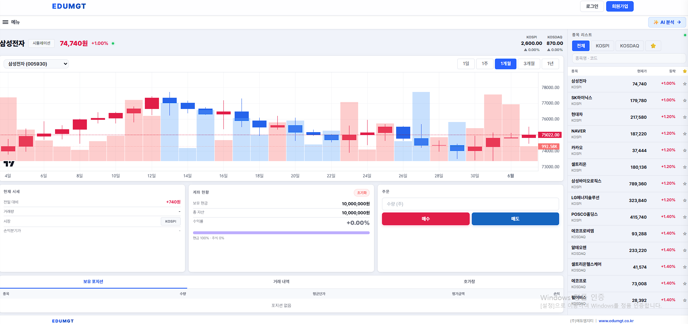
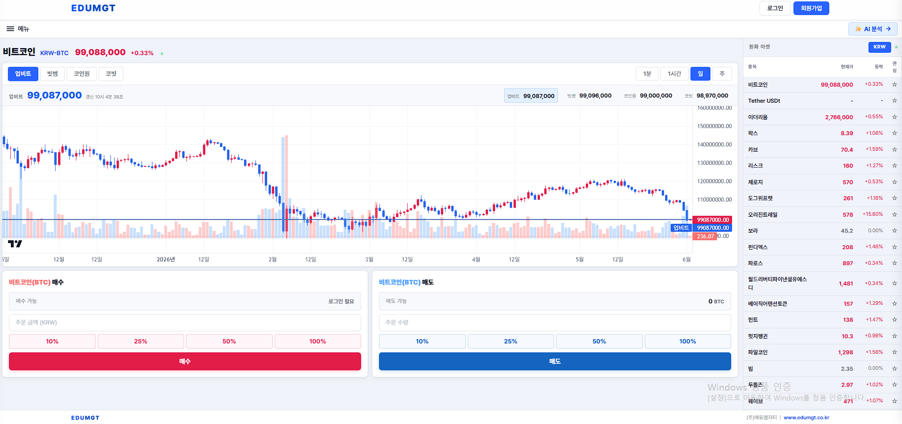
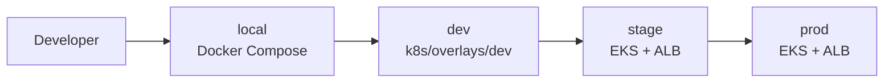
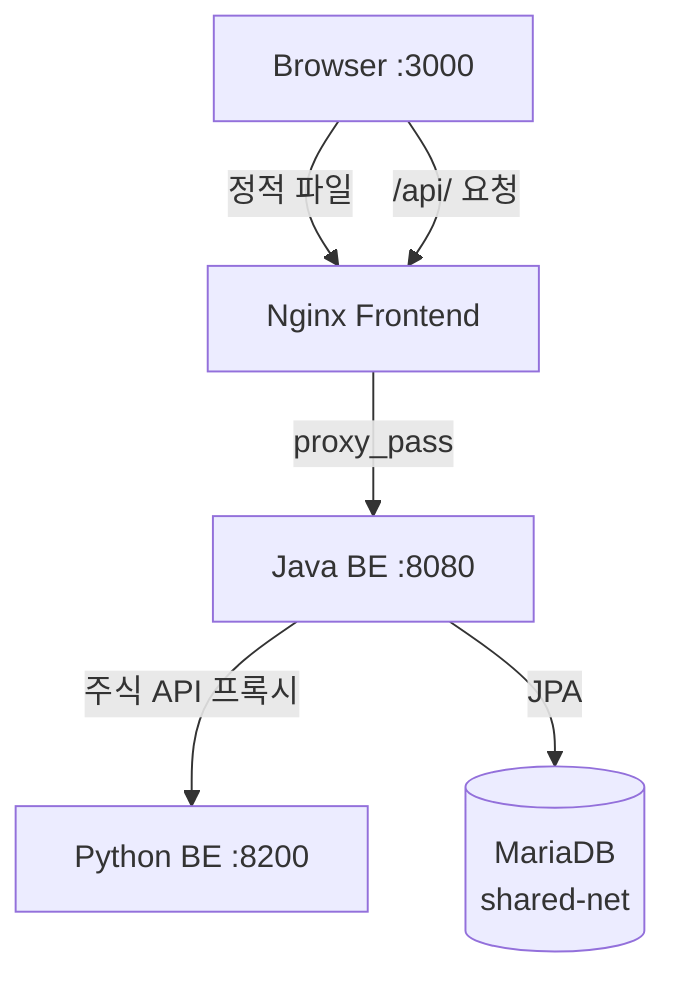
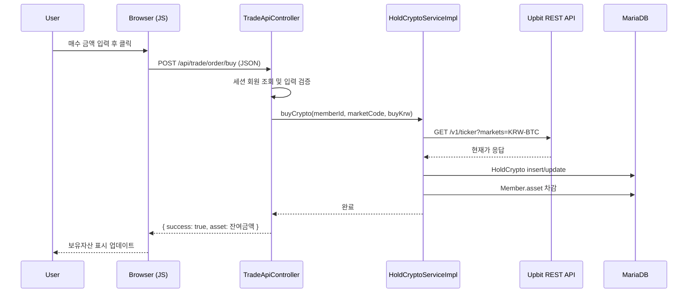
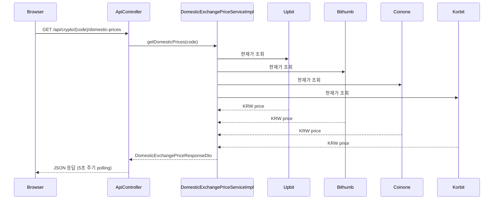
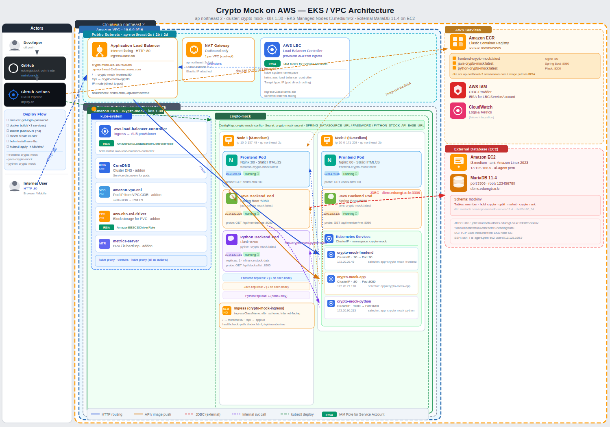
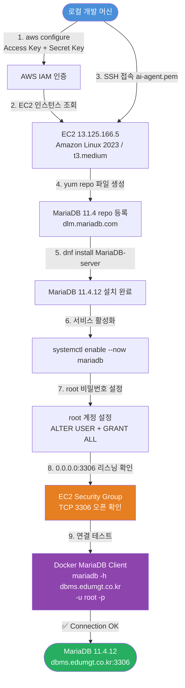

# 한국 코인·주식 모의투자 Web App

Spring Boot REST API + Vanilla JS 기반의 코인·주식 통합 모의투자 웹 애플리케이션입니다.  
업비트/빗썸/코인원/코빗 시세 비교와 KOSPI·KOSDAQ 주식 실습을 한 화면 흐름으로 제공합니다.

---





---

## 아키텍처

```
Browser
  │
  ▼
Nginx (Frontend · :3000)
  ├── /          → 정적 HTML/JS/CSS 서빙
  └── /api/      → Java Backend 프록시
        │
        ├── Java Backend (Spring Boot REST API · :8080 내부)
        │     └── MariaDB (external shared-net)
        │
        └── Python Backend (Flask · :8200 내부)
```

| 레이어 | 기술 | 역할 |
|---|---|---|
| **Frontend** | Vanilla JS + Tailwind CSS + Nginx | 정적 HTML 페이지, fetch API 호출 |
| **Java BE** | Spring Boot 3 · Spring Data JPA · BCrypt | 코인 매수/매도, 회원 인증, 시세 API |
| **Python BE** | Flask · yfinance | 주식 시세, 주문, 포지션 관리 |
| **DB** | MariaDB | 회원, 보유 코인, 업비트 마켓 |

---

## 1) 참고 앱 기능 분석 및 적용

6개 주요 주식·코인 거래 앱을 분석하여 아래 기능을 이 프로젝트에 반영하였습니다.

### 1-1. 분석 앱 및 주요 기능

| 앱 | 특징 | 핵심 참고 기능 |
|---|---|---|
| **토스증권** (KR) | 심플·초보 친화 UX, 모바일 퍼스트 | 관심종목(⭐) 등록·해제, 손익분기가(매입단가) 표시, 간편 %비율 주문 버튼 |
| **키움증권** (KR) | 전문 트레이더 특화, 최다 사용자 | 호가창(매도/매수 호가 레벨), 거래 내역(체결 내역), 상승·하락 TOP 종목 랭킹 |
| **삼성증권 POP** (KR) | 자산 분석 중심, 포트폴리오 뷰 | 포트폴리오 파이 차트(종목별 보유 비중 도넛 차트), 보유자산 시각화 |
| **Robinhood** (US) | 수수료 0원, 감성 피드 UX | 관심종목(Watchlist), 주문 성공/실패 즉시 피드백 메시지, 깔끔한 손익 표시 |
| **eToro** (EU) | 소셜 트레이딩, 멀티 마켓 | 시장 탭 필터(KOSPI / KOSDAQ / 관심종목), 종목명·코드 통합 검색 |
| **Trading 212** (EU) | 모의투자 연습 특화, 파이 포트폴리오 | 계좌 초기화(모의투자 전체 리셋), 종목 검색, 직관적 포지션 관리 |

### 1-2. 이 프로젝트에 적용된 기능

| 기능 | 참고 앱 | 위치 |
|---|---|---|
| ⭐ 관심종목 (Watchlist) | 토스증권·Robinhood | 주식 거래 / 코인 거래 마켓 리스트 |
| 📋 호가창 (Order Book) | 키움증권 | 주식 거래 · 매도/매수 호가 5단계 |
| 📈 상승/하락 TOP 3 (Market Movers) | 키움증권 | 주식 거래 페이지 상단 |
| 🗒️ 거래 내역 (Trade History) | 키움증권·Robinhood | 주식 거래 페이지 하단 |
| 🥧 포트폴리오 파이 차트 | 삼성증권 POP | 주식 계좌 현황 카드 내 도넛 차트 |
| 🔄 계좌 초기화 | Trading 212 | 주식 계좌 현황 카드 초기화 버튼 |
| 🔍 종목 검색 | eToro·Trading 212 | 주식 거래 차트 섹션 검색창 |
| 🗂️ 시장 탭 필터 | eToro | 전체 / KOSPI / KOSDAQ / ⭐관심 탭 |
| 💡 손익분기가 표시 | 토스증권 | 주식 현재 시세 카드 (매입단가 표시) |

---

## 2) 주요 기능

- Tailwind 기반 반응형 UI (Vanilla JS · 서버 렌더링 없음)
- 회원가입/로그인 (세션 + BCrypt) — REST API + 쿠키 세션
- KRW 마켓 기준 코인 모의 매수/매도
- 주식 거래 실습 화면 (Python 백엔드 연동)
- 보유자산(평가금액/수익률) 실시간 계산
- 업비트 WebSocket 실시간 시세
- 국내 4대 거래소 시세 비교 (`GET /api/crypto/{code}/domestic-prices`)
- Docker Compose 3-컨테이너 구성 (Nginx + Java + Python)
- Kubernetes / Amazon EKS 배포 구성

---

## 3) 테스트 로그인 계정

앱 시작 시 아래 계정이 없으면 자동 생성됩니다.

- `test1@test.com / 123456`
- `test2@test.com / 123456`

---

## 4) 기술 스택

| 분류 | 기술 |
|---|---|
| **Frontend** | Vanilla JS, Tailwind CSS (CDN), Highcharts, ApexCharts, TradingView Widget |
| **Java Backend** | Java 17, Spring Boot 3.1.2, Spring Data JPA, Spring Security |
| **Python Backend** | Python 3.11, Flask, yfinance |
| **DB** | MariaDB |
| **Infra** | Docker, Docker Compose, Nginx, Kubernetes, Amazon EKS |
| **Security** | BCrypt + HTTP Session |
| **External API** | Upbit REST/WebSocket, Bithumb REST, Coinone REST, Korbit REST, CoinMarketCap REST |

---

## 5) 저장소 구조

```
stock-coin-trade/
├── frontend/                    # Vanilla JS 정적 프론트엔드
│   ├── index.html               # 홈 (시가총액 Top 100)
│   ├── trade/
│   │   ├── order.html           # 코인 거래
│   │   ├── hold.html            # 보유자산
│   │   └── stock.html           # 주식 실습
│   ├── member/
│   │   ├── login.html
│   │   └── register.html
│   ├── js/
│   │   ├── config.js            # API base URL 설정
│   │   ├── common.js            # 헤더 렌더, 인증 유틸
│   │   ├── order.js             # 코인 거래 로직
│   │   ├── hold_crypto.js       # 보유자산 로직
│   │   └── stock.js             # 주식 거래 로직
│   ├── css/style.css
│   ├── fonts/
│   └── img/
│
├── java-backend/                # Spring Boot REST API
│   ├── pom.xml
│   └── src/main/java/.../
│       ├── controller/api/
│       │   ├── MemberApiController.java      # 로그인/회원가입/me
│       │   ├── CryptoMarketApiController.java # 랭킹/마켓 목록
│       │   ├── TradeApiController.java        # 매수/매도/보유자산
│       │   ├── ApiController.java             # 코인 상세, 국내 시세
│       │   └── StockApiProxyController.java   # Python BE 프록시
│       └── ...
│
├── python-stock-backend/        # Flask 주식 API
│   ├── app.py
│   └── requirements.txt
│
├── database/
│   └── db.sql                   # 초기 스키마
│
├── docker/
│   ├── frontend.Dockerfile
│   ├── java-backend.Dockerfile
│   ├── python-backend.Dockerfile
│   └── nginx.conf
│
├── docker-compose.yml
├── k8s/                         # Kubernetes 매니페스트
└── scripts/                     # AWS / CI/CD 스크립트
```

---

## 6) REST API 엔드포인트

### 회원

| Method | Path | 설명 | 인증 |
|---|---|---|---|
| `GET`  | `/api/member/me`       | 현재 로그인 사용자 정보 | 불필요 |
| `POST` | `/api/member/login`    | 로그인 (세션 발급) | - |
| `POST` | `/api/member/register` | 회원가입 + 자동 로그인 | - |
| `POST` | `/api/member/logout`   | 로그아웃 | - |

### 코인

| Method | Path | 설명 |
|---|---|---|
| `GET` | `/api/crypto/rankings`                     | 시가총액 Top 100 (CoinMarketCap) |
| `GET` | `/api/crypto/market-list`                  | 업비트 KRW 마켓 목록 |
| `GET` | `/api/crypto/{code}`                       | 개별 코인 정보 + 보유 수량 |
| `GET` | `/api/crypto/{code}/domestic-prices`       | 국내 4대 거래소 시세 비교 |

### 거래 (로그인 필요)

| Method | Path | 설명 |
|---|---|---|
| `GET`  | `/api/trade/hold`       | 보유 코인 목록 + 자산 현황 |
| `POST` | `/api/trade/order/buy`  | 코인 매수 |
| `POST` | `/api/trade/order/sell` | 코인 매도 |

### 주식 (Python 백엔드 프록시)

| Method | Path | 설명 |
|---|---|---|
| `GET`  | `/api/stocks/list`           | 종목 목록 |
| `GET`  | `/api/stocks/market`         | KOSPI/KOSDAQ 지수 |
| `GET`  | `/api/stocks/quote`          | 개별 종목 시세 |
| `GET`  | `/api/stocks/chart`          | 캔들 차트 데이터 |
| `GET`  | `/api/stocks/movers`         | 상승/하락 TOP 3 |
| `GET`  | `/api/stocks/account`        | 계좌 현황 |
| `GET`  | `/api/stocks/positions`      | 보유 포지션 |
| `GET`  | `/api/stocks/orders/history` | 거래 내역 |
| `POST` | `/api/stocks/orders/buy`     | 주식 매수 |
| `POST` | `/api/stocks/orders/sell`    | 주식 매도 |
| `POST` | `/api/stocks/account/reset`  | 계좌 초기화 |

---

## 7) Docker 실행

### 7-1. 사전 요구사항

MariaDB는 외부 Docker 네트워크 `shared-net`에서 실행 중이어야 합니다.

```bash
# shared-net 네트워크 생성 (최초 1회)
docker network create shared-net

# MariaDB 컨테이너 실행 (shared-net 연결)
docker run -d \
  --name crypto-mock-db \
  --network shared-net \
  -e MARIADB_ROOT_PASSWORD=root \
  -e MARIADB_DATABASE=mockinv \
  -e MARIADB_USER=mockinv \
  -e MARIADB_PASSWORD=mockinv1234 \
  mariadb:11.4

# DB 초기 스키마 적용
docker exec -i crypto-mock-db mariadb -umockinv -pmockinv1234 mockinv < database/db.sql
```

또는 로컬 MariaDB 빠른 설정 스크립트 사용:

```bash
bash scripts/setup-docker-db.sh
```

### 7-2. 앱 실행

```bash
docker compose up -d --build
```

### 7-3. 접속

| 서비스 | URL |
|---|---|
| 웹 서비스 (Nginx) | `http://localhost:3000` |
| Java BE (내부용) | `http://localhost:3000/api/...` (nginx 프록시) |
| Python BE | 내부 전용 (Java가 프록시) |

### 7-4. 종료

```bash
docker compose down

# 볼륨까지 삭제
docker compose down -v
```

### 7-5. 컨테이너 구성

```
crypto-mock-frontend  (Nginx)         :3000 → :80
crypto-mock-java      (Spring Boot)   expose 8080 (내부만)
crypto-mock-python    (Flask)         expose 8200 (내부만)
```

Java BE와 Python BE는 외부 포트를 노출하지 않으며, Nginx가 `/api/` 요청을 내부 네트워크를 통해 `java-backend:8080`으로 프록시합니다.

---

## 8) 로컬 개발 (Docker 없이)

Frontend와 Java Backend를 분리 실행할 경우:

```bash
# 1. Java BE 실행
cd java-backend
mvn spring-boot:run

# 2. Python BE 실행
cd python-stock-backend
pip install -r requirements.txt
python app.py

# 3. Frontend 서빙 (python 예시, 포트 임의)
cd frontend
python -m http.server 3000
```

로컬 개발 시 CORS 이슈가 있으므로 [frontend/js/config.js](frontend/js/config.js)의 `apiBase`를 수정합니다:

```js
// frontend/js/config.js
window.APP_CONFIG = {
  apiBase: 'http://localhost:8080',  // Java BE 주소
};
```

---

## 9) Kubernetes 실행 (일반 k8s / dev)

### 9-1. base 배포

```bash
docker build -t java-crypto-mock-app:latest -f docker/java-backend.Dockerfile .
kubectl apply -k k8s/base
kubectl -n crypto-mock port-forward svc/crypto-mock-app 8080:80
```

### 9-2. dev overlay 배포

```bash
docker build -t java-crypto-mock-app:dev -f docker/java-backend.Dockerfile .
kubectl apply -k k8s/overlays/dev
kubectl -n crypto-mock-dev port-forward svc/crypto-mock-app 8080:80
```

---

## 10) Amazon EKS 실행

`k8s/eks`는 EKS + ALB Ingress + in-cluster MariaDB 구성입니다.

### 10-1. 사전 준비

- EKS 클러스터
- AWS Load Balancer Controller 설치
- ECR 리포지토리 생성
- `aws`, `eksctl`, `kubectl`, `docker` CLI

### 10-2. 이미지 빌드 / 푸시

```bash
aws ecr get-login-password --region ap-northeast-2 | \
  docker login --username AWS --password-stdin 123456789012.dkr.ecr.ap-northeast-2.amazonaws.com

docker build -t java-crypto-mock:latest -f docker/java-backend.Dockerfile .
docker tag java-crypto-mock:latest 123456789012.dkr.ecr.ap-northeast-2.amazonaws.com/java-crypto-mock:latest
docker push 123456789012.dkr.ecr.ap-northeast-2.amazonaws.com/java-crypto-mock:latest
```

### 10-3. 배포

```bash
kubectl apply -k k8s/eks
kubectl -n crypto-mock get ingress crypto-mock-ingress
```

### 10-4. 배포 스크립트

```bash
export AWS_REGION=ap-northeast-2
export CLUSTER_NAME=crypto-mock-stage
export ECR_REPO=java-crypto-mock-stage

./scripts/aws/01-env.sh
./scripts/aws/02-create-infra.sh
./scripts/aws/03-build-push-image.sh
./scripts/aws/04-deploy.sh
./scripts/aws/05-verify.sh
```

---

## 11) 환경 구분

| 환경 | 런타임 | DB | 진입점 | 배포 기준 |
|---|---|---|---|---|
| `local` | Docker Compose | 로컬 MariaDB 컨테이너 | `localhost:3000` | `docker compose up -d --build` |
| `dev` | 일반 Kubernetes | in-cluster MariaDB | port-forward | `k8s/overlays/dev` |
| `stage` | Amazon EKS + ALB | MariaDB PVC | ALB DNS | `k8s/eks` + `scripts/aws/*` |
| `prod` | Amazon EKS + ALB | 운영 DB | ALB / Route53 | `k8s/eks` + prod env |

---

## 12) CI/CD shell 구성

```bash
./scripts/cicd/ci.sh local
./scripts/cicd/ci.sh dev
./scripts/cicd/ci.sh stage

./scripts/cicd/deploy.sh local
./scripts/cicd/deploy.sh dev
./scripts/cicd/deploy.sh stage
./scripts/cicd/deploy.sh prod
```

| 환경 | 동작 |
|---|---|
| `local` | Maven build + docker compose 검증 후 로컬 기동 |
| `dev` | Maven build + k8s/overlays/dev 검증 후 일반 k8s 배포 |
| `stage/prod` | Maven build + ECR push + EKS 배포 |

---

## 13) Mermaid 다이어그램

### 13-1. 환경별 배포 흐름



### 13-2. Docker 런타임 구조



### 13-3. 매수 처리 시퀀스



### 13-4. 국내 거래소 시세 비교 시퀀스



---

## 14) AWS 아키텍처



---

## 15) MariaDB EC2 배포 플로우

### 환경 정보

| 항목 | 값 |
|---|---|
| **EC2 IP** | `13.125.166.5` |
| **도메인** | `dbms.edumgt.co.kr` |
| **OS** | Amazon Linux 2023 |
| **MariaDB** | 11.4.x (LTS) |
| **포트** | 3306 |
| **접속 계정** | `root / 12345678!!` |

### 배포 플로우



### 단계별 명령어 요약

```bash
# 1. AWS CLI 구성 (access key 기반)
aws configure set aws_access_key_id     <ACCESS_KEY_ID>
aws configure set aws_secret_access_key <SECRET_ACCESS_KEY>
aws configure set region                ap-northeast-2

# 2. EC2 인스턴스 확인
aws ec2 describe-instances \
  --filters "Name=ip-address,Values=13.125.166.5" \
  --query 'Reservations[*].Instances[*].{ID:InstanceId,State:State.Name}'

# 3. SSH 접속
chmod 400 ai-agent.pem
ssh -i ai-agent.pem ec2-user@13.125.166.5

# 4. MariaDB 11.4 repo 등록 (EC2 내부)
sudo tee /etc/yum.repos.d/mariadb.repo << 'EOF'
[mariadb]
name = MariaDB 11.4
baseurl = https://dlm.mariadb.com/repo/mariadb-server/11.4/yum/rhel/9/x86_64
gpgkey = https://downloads.mariadb.com/MariaDB/RPM-GPG-KEY-MariaDB
gpgcheck = 1
enabled = 1
EOF

# 5. 설치 및 서비스 시작
sudo dnf install -y MariaDB-server MariaDB-client
sudo systemctl enable --now mariadb

# 6. root 계정 설정
sudo mariadb -u root << 'SQL'
ALTER USER 'root'@'localhost' IDENTIFIED BY '12345678!!';
CREATE USER IF NOT EXISTS 'root'@'%' IDENTIFIED BY '12345678!!';
GRANT ALL PRIVILEGES ON *.* TO 'root'@'%' WITH GRANT OPTION;
FLUSH PRIVILEGES;
SQL

# 7. Docker MariaDB 클라이언트로 접속 테스트 (로컬에서)
docker run --rm mariadb:11.4 \
  mariadb -h dbms.edumgt.co.kr -u root -p'12345678!!' \
  -e "SELECT VERSION(), NOW(), 'Connection OK' AS status;"
```

---

## 16) 주요 경로

| 분류 | 경로 |
|---|---|
| **프론트엔드** | `frontend/` |
| **Java 백엔드** | `java-backend/` |
| **Python 백엔드** | `python-stock-backend/` |
| **DB 스키마** | `database/db.sql` |
| **Docker** | `docker-compose.yml`, `docker/` |
| **Kubernetes(base)** | `k8s/base/` |
| **Kubernetes(dev)** | `k8s/overlays/dev/` |
| **EKS** | `k8s/eks/` |
| **AWS 스크립트** | `scripts/aws/` |
| **CI/CD 스크립트** | `scripts/cicd/` |
| **AWS 콘솔 이미지** | `docs/aws-console/` |
| **AWS 아키텍처 SVG** | `docs/architecture-eks.svg` |

---

# 벡터 데이터베이스(Vector DB) vs 관계형 데이터베이스(RDBMS) 핵심 비교 가이드

본 문서는 전통적인 관계형 데이터베이스(MariaDB)와 AI 기반 서비스의 핵심 인프라인 벡터 데이터베이스(Qdrant)의 패러다임 차이, 작동 방식, 그리고 인덱싱 및 데이터 적재 과정에 대한 핵심 내용을 정리한 가이드입니다.

---

## 1. 핵심 차이점 비교 (Overview)

| 비교 항목 | Qdrant (Vector DB) | MariaDB (RDBMS) |
| :--- | :--- | :--- |
| **주요 데이터 형태** | 고차원 벡터 데이터 (Embedding Vector) | 정형 데이터 (텍스트, 숫자, 날짜 등) |
| **데이터 구조** | 컬렉션(Collection), 포인트(Point), 페이로드(Payload) | 데이터베이스(Database), 테이블(Table), 행/열(Row/Column) |
| **검색 방식** | **유사도 기반 검색 (ANN)**<br>"이 데이터와 맥락이 가장 비슷한 것 5개 찾아줘" | **조건 일치 검색 (SQL)**<br>"이름이 '홍길동'이고 나이가 20세인 사람 찾아줘" |
| **핵심 인덱스** | HNSW (Hierarchical Navigable Small World) 등 | B-Tree, B+Tree |
| **데이터 정합성** | 확률적 결과 (유사도 거리에 따른 근사치) | 철저한 일관성 (**ACID 트랜잭션** 보장) |
| **주요 활용처** | AI 기반 검색, RAG(검색 증강 생성), 추천 시스템 | 회원 관리, 결제/금융 시스템, 전통 웹 백엔드 |

---

## 2. 데이터 적재(Data Pipeline) 용어의 이해

흔히 AI 현업에서 **"참고용 문서를 먹인다"**라고 표현하는 과정은 데이터베이스의 전통적인 데이터 흐름 및 가공 단계와 완벽히 매칭됩니다.

```
[원본 문서 (PDF/Web)] ──(Ingest)──> [텍스트 분할 & 임베딩] ──(Insert/Upsert)──> [Qdrant 저장]
```

* **데이터 인제스트 (Data Ingestion / 수집·유입):** 외부에 있는 원본 문서(PDF, Word, 웹페이지 등)를 시스템 내부로 가져와 가공(Chunking 등)하는 **전체적인 초기 프로세스**를 의미합니다.
* **데이터 인서트 (Data Insertion / 삽입):** 가공 및 변환이 완료된 고차원 벡터 값을 데이터베이스에 **처음으로 새롭게 저장**하는 명확한 동작입니다.
* **데이터 업서트 (Data Upsert / 갱신 및 삽입):** `Update + Insert` 장점을 합친 방식입니다. 데이터가 **기존에 없으면 새로 저장(Insert)하고, 이미 같은 식별자가 존재하면 최신 데이터로 덮어쓰기(Update)**를 수행합니다. 중복 적재를 막기 위해 벡터 DB 파이프라인에서 가장 애용되는 방식입니다.

---

## 3. 인덱스(Index) 메커니즘의 차이

### MariaDB: B-Tree 인덱스
* **개념:** 데이터를 '특정 기준(값)으로 정렬'하여 계층형 구조로 배치하는 방식입니다.
* **특징:** 책 뒷면의 색인(찾아보기)과 같습니다. 조건을 엄격하게 비교하여 (`id = 5` 또는 `age > 20`) 조건에 부합하는 데이터를 **100% 정확하게** 찾아냅니다.

### Qdrant: HNSW 그래프 인덱스
* **개념:** 고차원 공간에 점으로 표현된 벡터들을 **서로 가까운(유사한) 것끼리 선으로 연결하여 다층(Layered) 구조의 네트워크 지도**를 만드는 방식입니다.
* **특징:** 모든 데이터와의 거리를 계산하면 속도가 너무 느려지므로, 그래프 지도를 활용해 최단 거리에 있을 확률이 높은 데이터를 초고속으로 찾아내는 **ANN(근사 최근접 이웃)** 검색을 수행합니다. 결과는 수학적 확률과 유사도 점수로 표현됩니다.

---

## 4. 주요 벡터 데이터베이스(Vector DB) 종류 및 특징

시장에는 Qdrant 외에도 다양한 요구사항에 맞춘 벡터 데이터베이스들이 존재하며, 크게 **전용(Native) DB**와 **기존 DB의 확장형(Extension)**으로 구분됩니다.

### ① 전용(Native) 벡터 DB
* **Qdrant (큐드란트):** Rust 언어로 개발되어 가볍고 빠르며, 강력한 필터링 기능과 오픈소스/자체 구축 환경에 최적화되어 있습니다.
* **Pinecone (파인콘):** 완전 관리형(SaaS) 클라우드 서비스로, 인프라 관리 없이 API 연동만으로 빠르게 AI 서비스를 고도화할 수 있습니다. (서버리스/제옵스)
* **Milvus (밀버스):** 쿠버네티스 기반의 분산 아키텍처를 지원하여 수억에서 수십억 건 규모의 초대형 엔터프라이즈 데이터 처리에 적합합니다.
* **Weaviate (위비에이트):** 키워드 검색(BM25)과 벡터 유사도 검색을 결합한 하이브리드 검색 역량이 뛰어나며 객체 지향 데이터 모델을 지원합니다.
* **Chroma (크로마):** 파이썬 환경에서 메모리/로컬 기반으로 빠르게 동작하여 프로토타입(MVP) 빌드나 AI 실험 시 선호됩니다.

### ② 확장형(Extension) 벡터 DB
* **PostgreSQL + pgvector:** 전통적인 RDBMS 환경 위에서 관계형 데이터와 벡터 데이터를 `SQL JOIN`으로 함께 쿼리할 수 있어 단일 DB 아키텍처 유지에 유리합니다.
* **Elasticsearch / OpenSearch:** 뛰어난 키워드 검색 역량에 벡터 검색 기능을 추가하여, 하이브리드 검색 기반의 대규모 텍스트 검색엔진 구현 시 유수 기업들이 사용합니다.