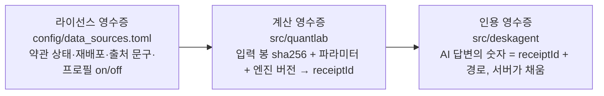

# Noah Trading Desk — 모든 숫자에 영수증이 있는 퀀트 리서치 데스크

[](https://github.com/Noah-TaeHwan/stock-coin-trade/actions/workflows/ci.yml)

원본 저장소 [edumgt/stock-coin-trade](https://github.com/edumgt/stock-coin-trade)(주식·코인 모의투자와 Open API 실습 플랫폼)를 포크했다. 그 위에 **데이터 출처, 백테스트 계산, AI 답변의 숫자를 모두 추적할 수 있는** 퀀트 리서치 데스크를 만든 개인 포트폴리오다. 원본 기능은 [아래 절](#원본-기능-edumgt)에 따로 정리했다.

## 세 층의 영수증


```mermaid
flowchart LR
  A["라이선스 영수증<br/>config/data_sources.toml<br/>약관 상태·재배포·출처 문구·프로필 on/off"] --> B["계산 영수증<br/>src/quantlab<br/>입력 봉 sha256 + 파라미터 + 엔진 버전 → receiptId"]
  B --> C["인용 영수증<br/>src/deskagent<br/>AI 답변의 숫자 = receiptId + 경로, 서버가 채움"]
```

1. **라이선스 영수증**: 약관을 확인한 소스만 공개 배포에 쓴다. 정책 테스트가 이를 강제한다. 지금 public에서 쓸 수 있는 소스는 결정적 합성 데이터뿐이다.
2. **계산 영수증**
   - 백테스트는 종가에 신호를 내고 다음 봉 시가에 체결한다. 비용을 반영하고, 지표는 일별 자산곡선으로 계산한다.
   - 같은 입력이면 같은 `receiptId`가 나오고, 서버는 실행을 한 번만 저장한다.
3. **인용 영수증**
   - AI 에이전트는 숫자를 직접 쓰지 않고 `{{n1}}` 자리표시자와 (영수증, 경로)만 낸다. 서버가 값을 채운다.
   - 영수증 없는 숫자가 들어간 답변은 보여 주지 않는다. "AI가 숫자를 지어내지 않는다"고 주장하는 대신, 구조로 막고 eval로 잰다.

## 결과 한눈에

| 항목 | 값 | 근거 |
|---|---|---|
| 테스트 | 302개 통과(MariaDB 11.4·PostgreSQL 16 통합 포함), 핵심 방어 코드마다 변형 테스트 | [검증 기록 색인](docs/evidence/README.md) |
| 구 백테스트 엔진 오류 | 7개 수정(예: 005930 RSI 전략 Sharpe 587.39 → 6.72, MDD 0.00% → -0.50%) | [quant-engine](docs/evidence/quant-engine-2026-09-25.md) |
| AI 숫자 영수증 eval(30사례 × 2회) | 완벽 모델 100%, 숫자를 지어내는 모델 3종(직접 입력·일부 위조·가짜 영수증) 0% | [eval](evals/numeric_faithfulness/README.md) |
| 과최적화 측정(합성 데이터) | 005930 MA 교차: 사후 최적 +51.4% vs 워크포워드 +15.8% | [리서치](docs/research/README.md) |
| 공개 배포 차단 요인 | 주문 lost update, 저장형 XSS(실행 5·7회 → 0회), SSRF, 관리자 선점, 의존성 취약점 0건 | [Phase 1 기록](docs/evidence/README.md) |
| 라우트 | local 132개 / public 62개(실습·약관 미확인 기능 제외, 스냅샷으로 고정) | `tests/unit/snapshots/` |

## 직접 확인하기

- **로컬 실행**: [PORTFOLIO_LOCAL.md](PORTFOLIO_LOCAL.md). 공개 구성은 `compose.public.yml`(+ `compose.edge.yml` HTTPS)이다.
- **화면**
  - 퀀트 백테스트: `/quant.html` — 자산·낙폭 차트, 지표, 계산 영수증
  - AI 리서치: `/research-agent.html` — 초대 코드 필요, 숫자마다 영수증 링크
- **재현**
  - `PYTHONPATH=src python -m quantlab.research --symbol 005930 --start 2016-01-01 --end 2025-12-31`
  - `PYTHONPATH=src python -m deskagent.eval --mode oracle`
- **MCP**: `PYTHONPATH=src python -m deskmcp.server` — [Noah Desk MCP](#noah-desk-mcp--모의계좌백테스트를-mcp-도구로)
- **공개 데모**: <https://13-124-251-180.sslip.io> (AWS Lightsail 서울, 2026-09-28 EC2에서 이전, [이전 기록](docs/evidence/lightsail-migration-2026-09-28.md)). 데모 계정 `test@test.com` / `test1234` 또는 로그인 화면의 **데모로 로그인**. 도메인을 사기 전까지 sslip.io 호스트명을 쓴다. AI 리서치는 꺼 두었고 나중에 초대 코드로 연다.
- **데이터**: 공개 화면과 리포트의 시세는 모두 합성 데이터다. 실제 시장 성과가 아니며, 소스별 약관 상태는 [데이터 소스](docs/data-sources.md)에 있다.

## Noah가 만든 것

| 위치 | 내용 |
|---|---|
| `src/marketdata` | 소스 레지스트리·합성/업비트 소스·품질 검사·수집 기록·파티션 |
| `src/quantlab` | 백테스트 엔진·지표·계산 영수증·워크포워드·리서치 CLI |
| `src/deskagent` | 숫자 영수증 AI 에이전트(공식 Anthropic SDK)·가격·eval |
| `src/deskmcp` | 데스크 API를 MCP 도구로 노출하는 서버 |
| `python-stock-backend/` | `create_app()`, 설정·권한·보안(CSRF·레이트 리밋·XSS·SSRF), 주문 정합성, 퀀트·에이전트 API(원본 모듈 수정분) |
| `infra/`, `compose.*.yml`, `scripts/ec2/` | AWS 공개 데모(CloudFormation, Caddy, 배포·롤백) |
| `tests/`, `docs/` | 테스트·검증 기록·ADR·방법론 |

작업 목록(시간순):
- pytest·ruff 설정, 해시로 고정한 의존성 lock, GitHub Actions CI(단위·MariaDB/PostgreSQL 통합·의존성 감사·이미지 빌드)
- import 부작용을 없앤 `create_app()` 팩토리, `APP_PROFILE`별 기동 검사, 테이블·시드를 맡는 일회성 `init` 서비스, 주기 작업을 맡는 `worker` 서비스
- 같은 회원의 동시 주식 주문이 옛 포지션을 읽어 초과 매도·이중 입금·500이 나던 문제 수정(MariaDB 재현 테스트), public 프로필에서 시뮬레이션 가격 체결 거부
- 관리자 선점·시스템 계정 로그인·이메일 중복 차단, 로그인·가입·키 발급 레이트 리밋, 전역 CSRF 출처 검사, 예외 원문 대신 요청 ID
- 저장형 XSS 차단(공용 이스케이프, Qdrant 추가 관리자 전용, 브라우저 검사), 크롤러 리디렉션 홉별 SSRF 검사, 공개 프로필에서 실습·외부 키 의존 기능 12개 제외, CORS 정확 일치
- 의존성 취약점 0건(Flask·flask-cors·requests·python-dotenv·qdrant-client 업그레이드), 비루트 백엔드 컨테이너, nginx 보안 헤더·`/health` 실제 프록시, 공개 배포용 `compose.public.yml`(Redis 레이트 리밋, 키·socket 미전달)
- 데이터 소스 레지스트리(약관 메타데이터·프로필별 on/off·공개 정책 테스트), 결정적 합성 시세, 업비트 캔들 어댑터, 품질 검사·수집 기록·파티션 관리(`src/marketdata`)
- 화면 시세도 레지스트리가 허용한 소스만 사용(공개 프로필은 합성 시세 + "합성 데이터" 배지, 코인 기능은 업비트 약관 확인 전까지 비활성)
- 백테스트 엔진 재작성(`src/quantlab`): 종가 신호 → 다음 봉 시가 체결, bp 단위 비용, 일별 자산곡선 기반 Sharpe·MDD·CAGR, 같은 비용의 매수 후 보유 비교, 입력 해시·파라미터·엔진 버전으로 만든 계산 영수증과 멱등 저장, 워크포워드 검증과 재현 가능한 리서치 리포트. 구 엔진의 계산 오류 7개를 회귀 테스트로 고정
- 자체 MCP 서버(`src/deskmcp`): 모의계좌 조회·백테스트·영수증 조회를 MCP 도구로 제공, 주문 도구는 명시적으로 켤 때만 등록, Open API 키별 요청 제한을 공유 저장소(Redis)로 이동
- 초대 코드 전용 AI 리서치(`src/deskagent`): 공식 Anthropic SDK 도구 루프, 답변의 숫자는 서버가 계산 영수증에서 채우고 영수증 없는 숫자는 차단, 초대 코드별 한도와 월 예산, 코드 채점 eval(완벽 모델 100%, 숫자를 지어내는 모델 3종 0%)
- AWS 공개 데모 준비: CloudFormation(80·443만 열고 SSH 없음, IMDSv2, 암호화·스냅샷 데이터 볼륨, 예산 알림), Caddy 자동 HTTPS(클라이언트 IP 보존), OIDC 배포 역할, 헬스 체크 실패 시 자동 롤백하는 배포 스크립트 — 2026-09-25 실제 배포(t3.small)

원본 코드 수정 허락은 [기록 문서](docs/provenance/PERMISSION.md)에 정리한다. 모든 검증 기록은 [색인](docs/evidence/README.md)에 있고, 설계 결정은 [ADR-0001 앱 팩토리](docs/adr/0001-app-factory.md), [ADR-0002 의존성 lock](docs/adr/0002-dependency-lock.md), [ADR-0003 AWS 구성](docs/adr/0003-aws-demo-topology.md)이다.

## 원본 기능 (edumgt)

원본 앱은 Flask REST API와 Vanilla JavaScript로 만든 주식·암호화폐 모의투자 및 OpenAPI 학습 플랫폼입니다. 국내 주식·코인 모의 주문, 대체자산 실습, 외부 연동용 Open API, 증권사·Alpaca Paper API 연습 화면을 제공합니다.

> 교육·연습용입니다. KIS Testbed와 Alpaca Paper에는 승인·제한 조건을 둔 주문→취소 테스트가 있으며, KIS 실전 계좌 연동은 잔고 조회만 제공합니다. 포트폴리오용 로컬 실행은 브로커 키를 전달하지 않아 이 외부 주문 흐름을 사용할 수 없습니다.

## 주요 기능

- 터미널형 다크 UI: 명령줄(`005930`, `BTC`, `HOLD`, `HELP` 등 입력 후 Enter), 기능키(`Alt+1~9`), 지수·코인·대표 종목 티커, 상승 초록·하락 빨강 의미 색과 색각이상 팔레트(`CVD`)
  - 화면번호 명령(`0130` 관심, `0101` 호가, `0400` 차트, `0600` 주문, `0919` 기업분석; `HTS` 입력 시 목록)과 주식 화면 하단 도크의 `KIS·KB 원본`(시세·호가·차트 원본 응답)·`메모` 탭
  - 테스트·로그·차트 화면은 한 화면 다열 패널, 학습 문서는 목차 레일과 읽기 폭
- 회원가입·로그인 기반 모의 주식·코인 거래와 보유자산·거래이력 조회
- KRX 주식 시세·차트·검색, 코인 시세·국내 거래소 가격 비교
- 코인 차익·김프(`/arbitrage.html`, 명령줄 `ARB`·`ARB ETH`): 원화 거래소 4곳과 OKX·Binance의 가격 차이, 김프(USDT·환율 기준), 캔들로 복원한 김프 추이, 호가 VWAP으로 계산한 거래소 쌍별 순손익(수수료·출금비 차감), 전송 시간·수수료 참고표, 빗썸 입출금 상태. 공개 시세만 쓰고 주문·출금 기능은 없음
- 대체자산(선물·옵션·금속·부동산 지분) 모의 주문
- AI Sheet: 공개 웹페이지 표 가져오기, 섹터별 상위 20개 종목의 최근 24개월 월별 종가 시트(yyyy-mm × 종목명) 생성
  - 퀀트분석: M-2까지의 월별 종가로 scikit-learn LinearRegression을 학습해 M-1을 예측하고 실제 값과 비교(종목명과 함께 고정 표시)
  - LEAN: 선택한 종목의 월별 종가로 QuantConnect LEAN(Docker) 매수 후 보유 백테스트를 실행하는 테스트 버튼 — 자세한 내용은 아래 "운영 시 유의사항" 참고
- 투자 분석 학습, Qdrant 기반 지식 검색 및 AI 분석 기능
- 외부 시스템용 Open API 키 발급 및 가상 주식계좌 연동 API
- 실전연습 학습 페이지
  - TradingView(Pine)
  - KB증권 Open API
  - 한국투자증권(KIS) API
  - Alpaca Paper Trading 및 Trading CLI
- 분석·도구의 읽기 전용 연결 테스트
  - `증권사 시세 테스트`: KIS Testbed 현재가, KB증권 인증 상태
  - `Alpaca Test`: Alpaca Paper 계정 상태
- (선택) VS Code·Codex용 한투 공식 KIS MCP 서버 연동 — 자세한 내용은 아래 "KIS MCP" 절 참고

## 4일 Open API 실습 커리큘럼

외부 플랫폼 가입·키 발급은 오전에, 이 웹앱의 안전한 조회·모의 실습은 오후에 진행하는 4일 과정입니다. Key·Secret·계좌번호는 제출물에 포함하지 않습니다.

| 일차 | 오전 | 오후 | 문서 |
|---|---|---|---|
| 1일차 | KIS 모의투자·API 신청 | Testbed 조회와 모의 주문→정정→취소 | [01.md](curriculum/01.md) |
| 2일차 | KB Open API 신청·키 발급 | 운영 시세·호가·차트 읽기 전용 조회 | [02.md](curriculum/02.md) |
| 3일차 | Alpaca Paper 계정·키 발급 | Paper 계정·시세와 주문→취소 흐름 | [03.md](curriculum/03.md) |
| 4일차 | Binance·Korbit 공개/개인 API 권한 구분 | 공개 시세·호가와 통합 보안 점검 | [04.md](curriculum/04.md) |

## 아키텍처

```text
Browser
  │
  ▼
Nginx Frontend (:3333)
  ├─ 정적 HTML / JavaScript / CSS
  ├─ /api/*      → Flask Backend
  └─ /openapi/*  → Flask Backend
                     │
                     ├─ MariaDB (회원·모의 주문)
                     ├─ PostgreSQL (퀀트 OHLCV·전략·체결·성과)
                     ├─ 국내·해외 시세 제공처
                     └─ KIS / KB증권 / Alpaca Paper API (선택, 조회·모의 주문 테스트)
```

| 영역 | 구성 | 역할 |
|---|---|---|
| Frontend | Nginx, HTML, Vanilla JS, Tailwind CDN | 화면·오프캔버스 메뉴·API 호출 |
| Backend | Flask, SQLAlchemy, Requests | 회원·모의 주문·시세·Open API·외부 API 테스트 |
| Data | MariaDB, PostgreSQL, Qdrant(선택) | 사용자·주문, 퀀트 시계열/백테스트, AI 지식 검색 |
| 운영 | Docker Compose | frontend, init(일회성 DB 초기화), python-backend, worker(주기 작업), mariadb·postgres(local-db profile) |

## 빠른 시작

Docker Engine과 [Docker Compose v2.24.4 이상](https://docs.docker.com/reference/compose-file/merge/#replace-value)이 필요합니다. [PORTFOLIO_LOCAL.md](PORTFOLIO_LOCAL.md)의 절차로 개인용 `.env.portfolio`를 생성하고 전용 Compose 프로젝트를 실행하세요. 이 경로는 로컬 DB를 분리하고 브로커·AWS 자격 증명과 호스트 Docker socket을 백엔드에 전달하지 않습니다. 외부 시세·AI 기능에는 별도 인터넷 연결과 키가 필요할 수 있습니다.

실행 후 로컬에서 다음 화면을 열 수 있습니다. 포트를 변경했다면 주소도 맞추세요.

| 주소 | 설명 |
|---|---|
| <http://localhost:3333> | 웹 애플리케이션 |
| <http://localhost:3333/broker-api-test.html> | KIS Open API 연결 테스트 |
| <http://localhost:3333/kis-api-explorer.html> | KIS API 탐색기 (공식 예제 기반 국내주식 API 목록·호출·응답 시각화) |
| <http://localhost:3333/kis-chart.html> | KIS 종목 차트 (별도 Testbed 키 설정 시 조회 가능) |
| <http://localhost:3333/kis-api-history.html> | KIS 자체 API·외부 TR 호출·오류 이력 Grid (로그인 필요) |
| <http://localhost:3333/alpaca-test.html> | Alpaca Paper API 테스트 |
| <http://localhost:3333/openapi.html> | 외부 연동 Open API 명세 |
| <http://localhost:3333/quant.html> | PostgreSQL 퀀트 랩 |
| <http://localhost:3333/arbitrage.html> | 코인 차익·김프 (공개 시세, 로그인 불필요) |

Nginx는 `/api/*`, `/openapi/*`를 Flask로 프록시합니다. 브라우저에서는 API 호출을 같은 origin으로 처리합니다.

종료 명령도 [로컬 실행 안내](PORTFOLIO_LOCAL.md#종료와-상태)를 따르세요. 데이터 보존을 위해 `down -v`는 사용하지 않습니다.

## 로컬 가입과 메뉴

로컬 앱의 `/member/register.html`에서 본인 테스트 계정을 만든 뒤 `/member/login.html`에서 로그인하세요. 가입 후 앱 내 가상 현금으로 주식·코인 모의 주문과 보유자산·거래이력을 확인할 수 있습니다. 원본 공개 사이트의 데모 로그인은 이 로컬 환경과 별개입니다. 기본 로컬 구성은 샘플 투자자 30개와 시스템 봇 20개를 생성하므로, 외부 공개 배포 전에는 시드 계정과 인증 정책을 별도로 정리해야 합니다.

좌측 공통 offcanvas 메뉴는 모든 페이지가 같은 `frontend/js/common.js`를 사용합니다.

| 메뉴 | 주요 화면 |
|---|---|
| 거래 | 코인, 주식, 대체자산 |
| 자산관리 | 보유자산, 거래이력, 물타기 계산기 |
| 실전연습 | TradingView(Pine), KB증권, 한국투자증권 API, Alpaca API |
| 분석 · 도구 | AI Sheet, Open API, 증권사 시세 테스트, Alpaca Test |

## API 요약

### 모의투자 주문·분석 API

모든 주문 API는 로그인 세션이 필요합니다. `preview` API는 현재 시세와 보유 현금·수량을 기준으로 실행 가능 여부만 계산하며, 주문·잔고·거래 이력을 변경하지 않습니다.

| Method | Path | 설명 |
|---|---|---|
| `POST` | `/api/stocks/orders/preview` | 주식 시장가 주문의 예상 체결 금액·현금·보유수량 변화 확인 |
| `POST` | `/api/trade/order/preview` | 코인 시장가 매수/매도의 예상 수량·금액 확인 |
| `POST` | `/api/alternatives/orders/preview` | 선물·옵션·금속·부동산 모의 주문의 증거금/현금 영향 확인 |
| `GET` | `/api/member/trading-activity?days=30` | 주식·코인·대체자산 체결을 합산한 기간별 거래 횟수·회전금액 통계 |
| `GET` | `/api/member/portfolio-analysis` | 자산배분, HHI 분산도, 레버리지 노출, 손익·업종 집중도 분석 |

### PostgreSQL 퀀트 API

로컬 `local-db` 프로필은 PostgreSQL도 함께 실행하며, 첫 기동 시 `database/quant-postgres.sql`이 월별 시계열 분석용 스키마와 명시적인 샘플 OHLCV를 준비합니다. 운영 환경에서는 `QUANT_DATABASE_URL`로 별도의 PostgreSQL을 지정합니다.

| Method | Path | 설명 |
|---|---|---|
| `GET` | `/api/quant/overview` | 적재 건수·사용 가능 심볼 |
| `GET` | `/api/quant/market-data?symbol=005930` | 파티션된 OHLCV 조회 |
| `GET` | `/api/quant/signals?symbol=005930&fast=20&slow=50` | 윈도우 함수 기반 MA 시그널 |
| `POST` | `/api/quant/backtests` | quantlab 백테스트: 지표·매수 후 보유 비교·일별 자산곡선·계산 영수증. 같은 입력은 한 번만 저장([방법론](docs/methodology/backtest.md)) |
| `GET` | `/api/quant/results?strategyId=` | 저장된 전략과 거래 로그 |
| `GET` | `/api/quant/data-quality?symbol=` | 저장된 봉의 품질 검사와 마지막 수집 기록 |
| `GET` | `/api/quant/backtests/<receiptId>` | 영수증으로 저장된 실행 조회 |
| `GET` | `/api/quant/sources` | 데이터 소스 레지스트리(이 배포의 프로필 기준 사용 여부·출처 문구) |

웹 화면은 임의 SQL을 실행하지 않고, 파라미터 바인딩된 읽기 전용 SQL 템플릿만 보여주고 실행합니다. 이는 데이터 조회 편의성과 운영 DB 보호를 함께 고려한 방식입니다.

### PostgreSQL 퀀트 구성

퀀트 기능은 기존 회원·모의 주문 MariaDB와 분리된 PostgreSQL 16을 사용합니다. 웹 브라우저는 PostgreSQL에 직접 접근하지 않으며, Nginx → Flask API → PostgreSQL 순서로 내부 Docker 네트워크에서만 통신합니다.

| 계층 | 기술 | 역할 |
|---|---|---|
| Web | Nginx, Vanilla JS | `/quant.html` 제공 및 `/api/quant/*` 프록시 |
| API | Python 3.11, Flask, SQLAlchemy, psycopg | 백테스트·팩터 회귀·파라미터 바인딩 |
| Quant DB | PostgreSQL 16 Alpine | OHLCV 파티션, BRIN, JSONB, 체결·성과·팩터 데이터 |
| Runtime | Docker Compose v2 | 내부 네트워크, 볼륨, 헬스체크, 재기동 |

로컬 실행은 [전용 Compose 안내](PORTFOLIO_LOCAL.md)를 따릅니다. `postgres` 컨테이너는 내부 Docker 네트워크에만 연결되며 호스트 포트 `5432`를 공개하지 않습니다. Flask 컨테이너의 기본 연결 문자열 형식은 다음과 같습니다.

```text
postgresql+psycopg://<QUANT_DB_USER>:<QUANT_DB_PASSWORD>@postgres:5432/<QUANT_DB_NAME>
```

공개 데모는 `compose.public.yml` + `compose.edge.yml`(Caddy HTTPS) + `compose.lightsail.yml`(로컬 태그 이미지, 두 번째 포트폴리오 중계)을 Lightsail 한 대(2 GB)에 올리는 구성입니다([운영 절차](docs/deploy/lightsail.md)). 2026-09-25~27에는 같은 앱을 EC2로 운영했습니다. 인프라는 `infra/cloudformation/stockdesk.yaml`, 배포는 GitHub OIDC → ECR → SSM Run Command → `scripts/ec2/deploy.sh`(헬스 체크 실패 시 자동 롤백)였고([ADR-0003](docs/adr/0003-aws-demo-topology.md), [배포 절차](docs/deploy/aws.md), [배포 기록](docs/evidence/aws-deploy-2026-09-25.md)), 2026-09-28에 Lightsail로 옮겼습니다([이전 기록](docs/evidence/lightsail-migration-2026-09-28.md)). 예전 `docker-compose.prod.yml`은 키·socket 마운트를 물려받으므로 공개 배포에 쓰지 않습니다.

### 세션 API

| 영역 | 대표 경로 | 인증 |
|---|---|---|
| 회원 | `POST /api/member/login`, `POST /api/member/register`, `POST /api/member/logout`, `GET /api/member/me` | 일부 불필요 |
| 국내 주식 시세 | `GET /api/stocks/list`, `/quote?symbol=`, `/chart?symbol=`, `/market` | 불필요 |
| 주식 모의 주문 | `GET /api/stocks/account`, `/positions`, `POST /api/stocks/orders/buy`, `/sell` | 로그인 필요 |
| 코인 | `GET /api/crypto/rankings`, `/market-list`, `/{code}`, `/{code}/domestic-prices` | 불필요 |
| 코인 모의 주문 | `GET /api/trade/hold`, `POST /api/trade/order/buy`, `/sell` | 로그인 필요 |
| 코인 차익·김프 | `GET /api/arb/snapshot`, `/{symbol}/matrix?sizeKrw=`, `/{symbol}/history?interval=1H\|1D`, `/network` | 불필요 |
| 대체자산 | `GET /api/alternatives/markets`, `/positions`, `POST /api/alternatives/orders` | 로그인 필요 |
| AI | `POST /api/ai/analyze`, `POST /api/ai-sheet/crawl` | 기능별 설정 필요 |

### 외부 연동 Open API

`/openapi/v1/*`는 이 플랫폼의 가상 주식계좌를 외부 모듈에서 조회·주문할 때 사용합니다. 웹에서 발급한 API 키를 `Authorization: Bearer <api_key>` 헤더에 넣습니다.

| Method | Path | 설명 |
|---|---|---|
| `GET` | `/openapi/v1/stocks` | 지원 종목 목록 |
| `GET` | `/openapi/v1/quote/{symbol}` | 종목 시세 |
| `GET` | `/openapi/v1/account` | 가상 계좌 요약 |
| `GET` | `/openapi/v1/positions` | 보유 포지션 |
| `GET` | `/openapi/v1/orders` | 주문 이력 |
| `POST` | `/openapi/v1/orders` | 가상 주식 주문 |

API 키당 분당 60회 제한이 적용됩니다. 키 원문은 발급 시 한 번만 표시되고 서버에는 SHA-256 해시만 저장됩니다.

## 브로커·Alpaca 연결 테스트

테스트 화면은 서버에서만 키를 읽습니다. 브라우저 응답·로그에 API Key, Secret, 접근 토큰, 계좌번호를 포함하지 않습니다.

| 화면 | 경로 | 호출 범위 |
|---|---|---|
| KIS 연결 테스트 | `/broker-api-test.html` | KIS Testbed 현재가·일봉·호가·잔고·시장지수 조회 |
| KIS API 탐색기 | `/kis-api-explorer.html` | 공식 저장소 `examples_llm/domestic_stock` 예제를 분석한 국내주식 REST API 131개 목록. Testbed 지원 조회 API 는 서버 경유로 호출하고 응답 JSON 을 한글 필드명 표·JSON 으로 표시. 카탈로그는 `scripts/build_kis_api_catalog.py` 로 재생성 |
| KIS 종목 차트 | `/kis-chart.html` | 종목명·코드 검색 후 1분·일·주·월·년봉 캔들 차트(거래량·이동평균 5/20/60)와 현재가 요약, 캔들 표. 백엔드 `/api/kis-chart/candles`·`/minutes` 가 KIS 기간별시세(FHKST03010100)·당일분봉(FHKST03010200)을 호출 |
| KIS API 호출 이력 | `/kis-api-history.html` | 자체 Flask API 요청과 공통 KIS 게이트웨이의 실제 Testbed TR 시도·재시도·오류·응답시간을 AG Grid로 조회. App Key·Secret·토큰·CANO는 저장 전에 마스킹 |
| KB 연결 테스트 | `/kb-api-test.html` | KB증권 토큰 인증·시세 설정 점검 |
| Alpaca Test | `/alpaca-test.html` | Alpaca Paper `GET /v2/account` 상태 조회 |

백엔드 엔드포인트는 다음과 같습니다.

```text
GET /api/broker-test/kis/quote?symbol=005930
GET /api/broker-test/kb/quote?symbol=005930
GET /api/alpaca-test/paper/account
```

KIS Testbed에는 호출 제한이 있으므로 토큰과 짧은 시세 결과를 서버에서 캐시합니다. KB증권 키가 인증 단계에서 거부되면 검증되지 않은 시세 URI를 추측해 호출하지 않습니다. Alpaca Test는 Paper 환경만 사용하고 주문·잔고·계좌번호를 반환하지 않습니다.

## 외부 플랫폼·증권사·거래소 API 사전 가입 및 이용 절차

이 저장소가 호출하는 모든 외부 API를 **가입·키 발급이 필요한 것**과 **가입 없이 바로 쓰는 공개 API**로 나눠 정리합니다. 실제 신청 화면·약관·요건은 각 서비스가 수시로 바꿀 수 있으므로, 신청 직전에는 항상 공식 사이트에서 최신 절차를 다시 확인하세요.

### 한눈에 보기

| 플랫폼 | 가입 필요 | API Key 발급 | 이 저장소의 저장 위치 | 이 프로젝트에서의 사용 범위 |
|---|---|---|---|---|
| 한국투자증권(KIS) | 계좌 개설 + 모의투자 별도 신청 | 필요 (모의 App Key·Secret) | `kis.key` 또는 `KIS_PAPER_*` 환경변수 | 모의(Testbed) 시세 조회, 로그인 회원용 잔고·모의 주문 흐름 테스트 |
| KB증권 | 계좌 개설(M-able) + Open API 신청 | 필요 (App Key·Secret) | `kb.key` 또는 `KB_APP_KEY`/`KB_APP_SECRET` | 토큰 인증, 시세·호가·차트 읽기 전용 조회 |
| Alpaca Markets | 이메일 가입 | 필요 (Paper Key·Secret) | `al.key` 또는 `ALPACA_API_KEY`/`ALPACA_SECRET_KEY` | Paper 계정 조회, 보호된 Paper 주문 흐름 테스트 |
| Binance | 공개 시세는 불필요 | 공개 시세는 불필요(인증 API·Testnet만 필요) | 해당 없음(미구현) | 공개 24hr 시세·호가만 조회 |
| Korbit | 공개 시세는 불필요 | 공개 시세는 불필요(개인 자산 API만 필요) | 해당 없음(미구현) | 공개 현재가·호가 조회, 국내가 비교 |
| 업비트·빗썸·코인원 | 불필요 | 불필요 | 해당 없음 | 코인 현재가·국내 거래소 가격 비교(공개 API) |
| CoinMarketCap | 가입 필요 | 필요 (`CMC_API_KEY`) | `.env`의 `CMC_API_KEY` | 코인 랭킹 정기 동기화(매시 정각), 미설정 시 건너뜀 |
| Anthropic (Claude API) | 가입 필요 | 필요 (`ANTHROPIC_API_KEY`) | `.env`의 `ANTHROPIC_API_KEY` | AI Sheet/투자 분석 기능, 미설정 시 경고만 표시하고 비활성 |
| TradingView | 무료 계정 가입 | 불필요 | 해당 없음 | Pine Script 실전연습(웹 위젯·Pine Editor) |
| 이 플랫폼 자체 Open API | 이 웹앱 회원가입 | 필요 (웹에서 발급) | 발급 시 1회 표시, 서버는 SHA-256 해시만 저장 | 가상 주식계좌 조회·주문 — 절차는 위 "외부 연동 Open API" 참고 |

### 1. 한국투자증권(KIS) Open API

1. 한국투자증권 계좌가 없다면 공식 앱/웹에서 비대면 계좌개설을 먼저 진행합니다. ([한국투자증권 로그인·가입](https://securities.koreainvestment.com/main/member/login/login.jsp))
2. [모의투자 안내](https://www.truefriend.com/main/research/virtual/_static/TF07da010000.jsp)에서 한국투자증권 고객 ID로 로그인해 **모의투자 참가 신청**을 하고, 완료 후 **나의계좌 → 계좌정보**에서 모의투자 전용 계좌번호(`CANO-상품코드`)를 확인합니다.
3. [KIS Developers](https://apiportal.koreainvestment.com)에 로그인해 **API 신청**에서 방금 만든 모의투자 계좌를 선택해 서비스를 신청합니다. 신청현황에서 모의투자용 **App Key·App Secret**이 발급됩니다. 실전 계좌 행의 키는 이 프로젝트에서 사용하지 않습니다.
4. 발급받은 값을 저장소 루트의 `kis.key`(`app_key=`, `secret=`, `account=CANO-상품코드`) 또는 `.env`의 `KIS_PAPER_APP_KEY`/`KIS_PAPER_APP_SECRET`/`KIS_PAPER_ACCOUNT_NO`에 저장합니다. 기존 `KIS_APP_KEY` 계열도 호환되지만 신규 배포는 모의투자 전용 변수 사용을 권장합니다. `KIS_ENVIRONMENT=paper` 외의 값은 서버가 거부합니다. 계좌번호는 `CANO-계좌상품코드`(예: `12345678-01`) 형식입니다.
5. 모의(Testbed) 도메인은 `https://openapivts.koreainvestment.com:29443`이며, 실전 도메인(`https://openapi.koreainvestment.com:9443`)은 사용하지 않습니다. 모의투자 토큰 발급은 **1분당 1회** 제한이 있으므로 짧은 간격으로 재시도하지 마세요.
6. 자세한 절차·스크린샷은 3단계 학습 페이지 [`/learning/kis-regist.html`](frontend/learning/kis-regist.html)(가입) → [`/learning/kis-dev.html`](frontend/learning/kis-dev.html)(키 발급) → [`/learning/kis-test.html`](frontend/learning/kis-test.html)(테스트)에, VS Code에서 자연어로 쓰는 공식 MCP 연동은 아래 "KIS MCP" 절에 정리되어 있습니다.
7. 공용 모의계좌 잔고·계좌 API·주문 테스트는 웹앱에 로그인한 모든 회원이 사용할 수 있습니다. 주문 실행은 CSRF 검증과 60초짜리 1회 승인 토큰을 추가로 요구합니다.
8. 모든 웹 기반 KIS 호출은 자체 Flask API와 `broker_test.kis_request()` 공통 게이트웨이를 순서대로 거칩니다. 로그인 회원의 자체 API 기록과 실제 KIS TR 시도는 `/kis-api-history.html`에서 확인할 수 있으며, 실패 시 사용이력과 시스템 오류 이력에 모두 마스킹하여 기록합니다.

### 2. KB증권 Open API

1. KB M-able 앱을 설치하고 비대면 계좌개설을 진행합니다(본인 명의 휴대폰·신분증 필요).
2. 앱에서 KB증권 ID를 등록한 뒤, PC 웹사이트에서 **클라우드 인증서 로그인** 등 본인 인증 수단으로 로그인합니다.
3. 로그인 후 **Open API → Open API 신청/조회** 메뉴에서 신청할 계좌를 선택하고 비밀번호를 입력해 조회한 뒤, 표시되는 API 그룹·이용기간·약관에 동의해 신청을 제출합니다.
4. 신청현황에서 **App Key·App Secret**을 확인해 저장소 루트의 `kb.key`(`AppKey=`, `Secret=`) 또는 `.env`의 `KB_APP_KEY`/`KB_APP_SECRET`에 저장합니다.
5. **클라우드 인증서 발급, ID 등록, 계좌 이용 등록은 심사 상황에 따라 개인별로 수시간이 걸릴 수 있으므로** 테스트 직전이 아니라 미리 신청해 두세요.
6. 개발 문서·API 명세는 [KB증권 Open API 포털](https://openapi.kbsec.com/intro)에서, 이 프로젝트의 실제 호출 대상은 `https://developer.kbsec.com:32484`(운영 환경)입니다. 주문·잔고 조회는 이 학습 도구에 포함되어 있지 않고 토큰 인증과 시세·호가·차트 읽기 전용 조회만 제공합니다. 절차 전체는 [`/learning/kb-securities.html`](frontend/learning/kb-securities.html) 참고.

### 3. Alpaca Markets (Paper Trading)

1. [Alpaca 가입/대시보드](https://app.alpaca.markets/signup)에서 이메일로 계정을 만들고 요구되는 이메일 확인 절차를 완료합니다.
2. 대시보드 좌측 상단 계정 선택기에서 **Paper Trading** 계정을 선택하거나 새로 생성합니다.
3. **Home** 대시보드의 **API Keys** 패널에서 Paper 계정용 Key·Secret을 생성합니다. Secret은 최초 표시 이후 다시 확인되지 않을 수 있으므로 즉시 저장합니다.
4. 발급받은 값을 저장소 루트의 `al.key`(`Key=`, `Secret=`) 또는 `.env`의 `ALPACA_API_KEY`/`ALPACA_SECRET_KEY`에 저장합니다. Paper 엔드포인트는 `https://paper-api.alpaca.markets`/`https://data.alpaca.markets`이며, Live는 키와 도메인이 모두 다르므로 이 프로젝트에서는 전환하지 않습니다.
5. 거주 국가에 따라 Live 계정 승인 여부·상품·세금 요건이 달라질 수 있지만, Paper 전용 계정은 별도 심사 없이 만들 수 있습니다.
6. 자세한 SDK(`alpaca-py`)·Trading CLI 사용법은 아래 "Alpaca Paper Trading" 절과 [`/learning/alpaca-api.html`](frontend/learning/alpaca-api.html) 참고.

### 4. Binance Spot

- **공개 시세·호가(`/binance-api-test.html`, `crypto_exchange_test.py`)는 가입·API Key 없이 바로 호출됩니다.** `GET https://api.binance.com/api/v3/ticker/24hr`, `.../depth` 등은 Key 없이 공개 데이터를 반환합니다.
- 인증이 필요한 계정·주문 API를 직접 붙이려면 [Binance](https://www.binance.com) 가입 후 API Key·Secret을 발급받아야 하며, 서명(HMAC SHA-256)과 IP 화이트리스트 설정이 필요합니다. 이 프로젝트는 해당 기능을 구현하지 않았습니다.
- 실습·검증용으로는 운영 키 대신 [Binance Spot Testnet](https://testnet.binance.vision)에서 별도 계정과 키를 발급받아 `https://testnet.binance.vision`을 사용하세요. 출금 권한은 어떤 경우에도 API 키에 부여하지 않는 것을 원칙으로 합니다.
- 절차·엔드포인트는 [`/learning/binance-api.html`](frontend/learning/binance-api.html) 참고.

### 5. Korbit(코빗)

- **공개 시세·호가(`/korbit-api-test.html`)는 가입·API Key 없이 바로 호출됩니다.** `GET https://api.korbit.co.kr/v2/tickers`, `.../orderbook` 등이 여기 해당합니다. `crypto.py`의 국내 거래소 가격 비교도 같은 공개 엔드포인트(`v1/ticker/detailed`)를 사용합니다.
- 개인 자산 조회·주문·입출금 API를 사용하려면 [Korbit](https://www.korbit.co.kr) 가입과 본인 인증 후 API Key를 발급받아야 하며, 키 발급 시 **자산 조회 / 주문 조회 / 주문 신청 / 입출금 조회·신청** 권한을 개별적으로 선택합니다. 이 프로젝트는 해당 기능을 구현하지 않았으며, 구현하더라도 출금 권한은 부여하지 않는 것을 권장합니다.
- 공식 API 문서: [docs.korbit.co.kr](https://docs.korbit.co.kr/). 절차는 [`/learning/korbit-api.html`](frontend/learning/korbit-api.html) 참고.

### 6. 업비트·빗썸·코인원 (국내 코인 시세 비교)

코인 상세 화면의 "국내 거래소 가격 비교"는 업비트(`api.upbit.com`), 빗썸(`api.bithumb.com`), 코인원(`api.coinone.co.kr`)의 **공개 시세 API**만 호출합니다. 세 거래소 모두 가입·로그인·API Key 없이 바로 조회할 수 있으며, 이 프로젝트는 매매를 하지 않으므로 계정 개설이 필요하지 않습니다.

### 7. CoinMarketCap (코인 랭킹 동기화)

1. [CoinMarketCap API](https://coinmarketcap.com/api/) 사이트에서 가입한 뒤 무료(Basic) 플랜 API Key를 발급받습니다.
2. 발급받은 값을 `.env`의 `CMC_API_KEY`에 저장합니다. `scheduler.py`가 매시 정각(Asia/Seoul) `https://pro-api.coinmarketcap.com/v1/cryptocurrency/listings/latest`를 호출해 코인 랭킹을 동기화합니다.
3. 키를 설정하지 않아도 앱은 정상 동작하며, 동기화 작업만 로그 경고와 함께 건너뜁니다.

### 8. Anthropic Claude API (AI Sheet · 투자 분석)

1. [console.anthropic.com](https://console.anthropic.com)에서 가입하고 결제 수단을 등록한 뒤 API Key를 발급받습니다.
2. 발급받은 값을 `.env`의 `ANTHROPIC_API_KEY`에 저장합니다. `ai.py`가 `https://api.anthropic.com/v1/messages`를 호출해 AI Sheet 크롤링 결과 분석·투자 분석 기능을 제공합니다.
3. 키를 설정하지 않으면 AI 분석 기능은 화면에 "ANTHROPIC_API_KEY가 설정되지 않았습니다" 안내만 표시하고 비활성 상태로 유지됩니다.

### 9. TradingView (Pine Script 실전연습)

[TradingView 가입·로그인](https://www.tradingview.com/accounts/signin/)에서 무료 계정을 만들면 차트 열람·Pine Editor 사용이 가능합니다. API Key 발급 절차는 없으며, 이 프로젝트는 TradingView의 공식 차트/Pine Script 학습 자료로 연결만 합니다. Pine Script를 저장하거나 전략 백테스트(Strategy Report)를 실행하려면 로그인이 필요합니다. 자세한 내용은 [`/learning/tradingview-pine.html`](frontend/learning/tradingview-pine.html) 참고.

### 10. 이 플랫폼 자체 Open API

위 외부 서비스와 달리, 이 웹앱이 자체 발급하는 `/openapi/v1/*` 키는 이 사이트에 회원가입 후 **회원 메뉴에서 직접 발급**합니다. 발급·인증·호출 제한 절차는 위 "외부 연동 Open API" 절을 참고하세요.

## AWS SSM Parameter Store 연동 트랙 (선택)

`kis.key`/`kb.key`/`al.key`처럼 브로커 키를 파일로 저장소 루트나 EC2 디스크에 두는 대신, **AWS Systems Manager Parameter Store**(SecureString)에서 키를 읽어오는 **완전히 별도의 백엔드 모듈·테스트 웹앱**입니다. 기존 `broker_test.py`, `broker_test_api.py`, `alpaca_test.py`, `alpaca_test_api.py`, `kb_token_test.py`와 `/broker-api-test.html`, `/alpaca-test.html`은 이 트랙과 무관하게 **지금까지의 키 파일 방식 그대로** 동작합니다 — 두 트랙은 서로 다른 URL·다른 Python 모듈을 사용하므로 한쪽을 설정하지 않아도 다른 쪽에 영향이 없습니다.

### 구성

| 구분 | 기존 키 파일 트랙 | 신규 AWS SSM 트랙 |
|---|---|---|
| 자격 증명 소스 | `kis.key`/`kb.key`/`al.key` 또는 `KIS_*`/`KB_*`/`ALPACA_*` 환경변수 | AWS SSM Parameter Store(SecureString) |
| 공용 헬퍼 | `broker_test.py`의 `_read_key_file`/`_credentials` | `aws_secret_store.py`의 `get_parameter`/`get_credentials` |
| KIS·KB 로직 | `broker_test.py` → `broker_test_api.py` (`/api/broker-test/*`) | `broker_test_aws.py` → `broker_test_aws_api.py` (`/api/aws-broker-test/*`) |
| Alpaca 로직 | `alpaca_test.py` → `alpaca_test_api.py` (`/api/alpaca-test/*`) | `alpaca_test_aws.py` → `alpaca_test_aws_api.py` (`/api/aws-alpaca-test/*`) |
| 테스트 웹앱 | `/broker-api-test.html`, `/alpaca-test.html` | `/aws-broker-api-test.html`, `/aws-alpaca-test.html` |

AWS SSM 트랙은 조회 범위를 의도적으로 좁혀 운영합니다. 먼저 SecureString 원문을 복호화하지 않는 준비 상태 점검(리전·IAM·파라미터 존재/타입)을 실행하고, KIS는 현재가·잔고, KB는 토큰 발급 점검·현재가, Alpaca는 계정·포지션·미국 시장 시계·종목 거래 가능 여부를 읽기 전용으로 확인합니다. 주문·정정·취소 API는 이 트랙에서 호출하지 않습니다.

### 1. IAM 정책 준비

EC2에 인스턴스 프로파일(권장) 또는 최소 권한 IAM 사용자를 만들고, 아래 파라미터 경로에만 `ssm:GetParameter`를 허용합니다. SecureString은 KMS 복호화 권한(`kms:Decrypt`)도 함께 필요합니다(기본 AWS 관리형 키 `alias/aws/ssm`를 쓰면 별도 키 생성 없이도 충분합니다).

```json
{
  "Version": "2012-10-17",
  "Statement": [
    {
      "Effect": "Allow",
      "Action": ["ssm:GetParameter"],
      "Resource": "arn:aws:ssm:<region>:<account-id>:parameter/stock-coin-trade/*"
    },
    {
      "Effect": "Allow",
      "Action": ["kms:Decrypt"],
      "Resource": "arn:aws:kms:<region>:<account-id>:key/*",
      "Condition": { "StringEquals": { "kms:ViaService": "ssm.<region>.amazonaws.com" } }
    }
  ]
}
```

### 2. 파라미터 생성

이름 규칙은 `/stock-coin-trade/<서비스>/<항목>`입니다(접두사는 `.env`의 `AWS_SSM_PARAMETER_PREFIX`로 바꿀 수 있습니다). AWS CLI로 한 번만 생성하면 되고, 값은 이 저장소·터미널 기록에 남기지 않습니다.

| 파라미터 | 값 |
|---|---|
| `/stock-coin-trade/kis/app_key` | KIS 모의투자 App Key |
| `/stock-coin-trade/kis/secret` | KIS 모의투자 App Secret |
| `/stock-coin-trade/kis/account` | 모의투자 계좌 `CANO-상품코드` (잔고 조회 시에만 필요) |
| `/stock-coin-trade/kb/app_key` | KB증권 App Key |
| `/stock-coin-trade/kb/secret` | KB증권 App Secret |
| `/stock-coin-trade/alpaca/api_key` | Alpaca Paper API Key |
| `/stock-coin-trade/alpaca/secret_key` | Alpaca Paper API Secret |

```bash
aws ssm put-parameter --name "/stock-coin-trade/kis/app_key" --type SecureString --value "<모의투자 App Key>"
aws ssm put-parameter --name "/stock-coin-trade/kis/secret"   --type SecureString --value "<모의투자 App Secret>"
aws ssm put-parameter --name "/stock-coin-trade/kis/account"  --type SecureString --value "12345678-01"
aws ssm put-parameter --name "/stock-coin-trade/kb/app_key"   --type SecureString --value "<KB App Key>"
aws ssm put-parameter --name "/stock-coin-trade/kb/secret"    --type SecureString --value "<KB App Secret>"
aws ssm put-parameter --name "/stock-coin-trade/alpaca/api_key"    --type SecureString --value "<Alpaca Paper Key>"
aws ssm put-parameter --name "/stock-coin-trade/alpaca/secret_key" --type SecureString --value "<Alpaca Paper Secret>"
```

### 3. 앱에서 접근하는 방법

- **EC2 배포**: 위 IAM 정책이 붙은 인스턴스 프로파일만 있으면 됩니다. `docker-compose.yml`의 `AWS_ACCESS_KEY_ID`/`AWS_SECRET_ACCESS_KEY`/`AWS_SESSION_TOKEN`은 비워 두세요 — `boto3`가 EC2 메타데이터에서 자동으로 자격 증명을 가져옵니다.
- **별도 AWS 실습 환경**: 필요한 경우에만 `.env`에 `AWS_REGION`과 임시 자격 증명을 설정합니다. [포트폴리오 로컬 실행](PORTFOLIO_LOCAL.md)은 AWS 자격 증명을 백엔드에 전달하지 않습니다.
- 두 경우 모두 `boto3`의 표준 자격 증명 탐색 순서를 그대로 사용하므로, 이 프로젝트 코드에는 AWS 액세스 키를 하드코딩하지 않습니다.

### 4. 접속·동작 확인

| 주소 | 설명 |
|---|---|
| `/aws-broker-api-test.html` | KIS 현재가·잔고, KB 토큰 발급·현재가 (AWS SSM) |
| `/aws-alpaca-test.html` | Alpaca Paper 계정·포지션·시장 시계·종목 정보 (AWS SSM) |
| `/learning/aws-ssm-key-management.html` | Parameter Store·KMS·IAM 최소권한·테스트 흐름 가이드 |

파라미터가 없거나 IAM 권한이 부족하면 화면에 "SSM Parameter Store에 …이(가) 없습니다" 같은 안전한 오류 메시지만 표시되고, AWS 자격 증명이나 파라미터 값은 응답·로그에 노출되지 않습니다.

## Noah Desk MCP — 모의계좌·백테스트를 MCP 도구로

`src/deskmcp`는 이 데스크의 HTTP API를 MCP 도구로 노출하는 자체 서버입니다(MCP Python SDK 2.2.0, stdio). DB에 직접 붙지 않고 브라우저·스크립트와 같은 HTTP 경로를 쓰므로, API 키·키별 요청 제한·모의계좌 범위·데이터 소스 레지스트리가 MCP 호출에도 그대로 적용됩니다.

| 도구 | 호출하는 API | 성격 |
|---|---|---|
| `list_sources` | `GET /api/quant/sources` | 읽기 |
| `get_quote`, `get_account`, `get_positions`, `list_orders` | `/openapi/v1/*`(API 키) | 읽기 |
| `run_backtest` | `POST /api/quant/backtests` | 저장하지만 멱등(같은 입력 → 같은 영수증) |
| `get_backtest` | `GET /api/quant/backtests/<receiptId>` | 읽기 |
| `place_paper_order` | `POST /openapi/v1/orders` | `DESK_MCP_ALLOW_ORDERS=1`일 때만 등록, 모의계좌 주문 |

```bash
pip install --require-hashes -r src/deskmcp/requirements.lock   # 또는 requirements-dev.lock
export DESK_API_KEY=...   # 데스크의 "API 키" 화면에서 발급
PYTHONPATH=src DESK_BASE_URL=http://127.0.0.1:3333 python3 -m deskmcp.server
```

`.vscode/mcp.json`(`noah-desk`, 키는 입력 창으로 받아 VS Code가 보관)과 `.codex/config.toml`(`env_vars`로 셸의 `DESK_API_KEY`를 전달)에 등록되어 있습니다. 도구 annotations(`read_only_hint` 등)는 클라이언트용 힌트이고, 실제 권한은 API 키의 회원과 모의계좌로 서버가 정합니다. 검증은 [검증 기록](docs/evidence/mcp-server-2026-09-25.md)을 참고하세요.

## KIS MCP — VS Code·Codex에서 자연어로 KIS API 사용하기

`/broker-api-test.html`의 KIS 연결 테스트와는 별개로, 한국투자증권은 AI 도구로 **MCP(Model Context Protocol)** 를 제공합니다. MCP는 생성형 AI가 외부 도구와 데이터에 표준 방식으로 연결되도록 하는 규약입니다. 이 절의 두 서버는 한투 공식 MCP이며, `broker_test.py`를 MCP로 감싼 것이 아닙니다. 이 데스크 자체의 MCP 서버는 위 "Noah Desk MCP" 절을 참고하세요.

| 구분 | 용도 | 공식 안내 |
|---|---|---|
| KIS Code Assistant MCP (코딩도우미) | 자연어로 필요한 Open API를 찾고, 파라미터·응답 구조를 포함한 호출 예제 코드를 생성 | [코딩도우미 MCP](https://apiportal.koreainvestment.com/tools-sample) |
| KIS Trading MCP (트레이딩) | 국내·해외주식, 선물·옵션, 채권, ETF/ETN·인증 등의 Open API를 MCP 도구로 호출 | [트레이딩 MCP](https://apiportal.koreainvestment.com/tools-trading) |

두 도구의 차이와 API 신청 → MCP 클라이언트 연결 → 보안인증키 발급 → 샘플 실행 절차는 [한국투자증권 MCP 소개](https://apiportal.koreainvestment.com/tools-mcp)에서 최신 내용을 확인하세요. 코딩도우미는 API 탐색·예제 생성용이고, 트레이딩 MCP는 API를 실제 호출할 수 있으므로 **모의투자 키와 계좌인지 운영자가 확인한 뒤** 연결하세요.

아래 구성은 한투 공식 저장소 [koreainvestment/open-trading-api](https://github.com/koreainvestment/open-trading-api)의 두 MCP 서버를 이 프로젝트의 VS Code와 Codex에 연결합니다.

### 설치 및 연결

Python 3.12+, Git이 필요합니다. 아래 명령은 [한투 공식 저장소](https://github.com/koreainvestment/open-trading-api/tree/main/MCP)의 두 서버를 Git 무시 폴더 `mcp/`에 내려받고, 전용 가상환경에 `uv`와 의존성을 설치합니다. 이 저장소를 새로 클론한 환경에서는 한 번 실행하세요.

```bash
bash scripts/setup_kis_mcp.sh
```

설치 스크립트는 키 없이 Code Assistant 구성 확인까지 실행합니다. `.codex/config.toml`은 이 프로젝트를 신뢰한 Codex CLI·IDE용, `.vscode/mcp.json`은 VS Code Copilot Chat용 두 서버 설정입니다. 둘 다 `scripts/kis_mcp.py`를 통해 공식 서버를 stdio로 실행합니다. 설치 직후에는 `kis-code-assistant`를 확인하세요. `kis-trading-paper`는 아래의 모의투자 키·계좌 설정과 별도 `trade --check`를 마친 뒤 개발 도구 세션을 다시 시작해 확인합니다.

거래 MCP는 저장소 루트 `.env` 또는 명시한 프로세스 환경변수의 `KIS_PAPER_APP_KEY`, `KIS_PAPER_APP_SECRET`, `KIS_PAPER_ACCOUNT_NO`만 자격 증명으로 사용합니다. 환경변수가 `.env`보다 우선합니다. 웹앱용 `kis.key`와 범용 `KIS_APP_KEY`, `KIS_APP_SECRET`, `KIS_ACCOUNT_NO`는 거래 MCP가 읽지 않습니다. 계좌번호는 `12345678-01` 형식이어야 합니다. 키와 계좌번호는 MCP 설정 파일에 기록되지 않습니다. 코드는 키 값이 실제로 모의투자용인지 판별할 수 없으므로, 세 값의 발급 용도와 계좌를 운영자가 확인해야 합니다.

```bash
python3 scripts/kis_mcp.py trade --check
```

이 거래 점검은 모의투자 전용 키와 계좌를 준비한 후 별도로 실행하세요. `--check`는 설정만 확인하며 주문을 실행하지 않습니다.

### 로컬 MCP 질의 창

IDE 채팅 없이 공식 MCP 도구를 직접 호출하려면 아래 명령을 실행하세요. 브라우저에서 `http://127.0.0.1:8765/`가 열립니다. 창은 이 컴퓨터에서만 접근할 수 있으며 웹앱 배포 경로에는 포함되지 않습니다.

```bash
"mcp/open-trading-api/MCP/KIS Code Assistant MCP/.venv/bin/python" scripts/mcp_query_window.py
```

코드 검색 서버와 모의 거래 서버를 선택하고 도구의 설명·입력 스키마를 확인한 뒤 JSON 인자를 입력해 실행할 수 있습니다. 코드 검색 도구는 검색어 입력란을 빠르게 사용할 수 있습니다. 거래 도구는 매번 호출 내용 확인 창을 거칩니다. 종료는 실행 터미널에서 `Ctrl+C`입니다. 설치가 끝나지 않았다면 먼저 `bash scripts/setup_kis_mcp.sh`를 실행하세요.

거래 실행기는 범용 `KIS_APP_*` 변수를 전달하지 않고 공식 서버의 `~/KIS/config/kis_devlp.yaml` 출력 위치를 Git 무시된 `mcp/home/`으로 격리합니다. 코드에서 사용하는 `ENV=live`는 공식 서버의 `.env.live` 전송 설정 파일 이름이며, 키의 실제 발급 용도를 검증하는 표시는 아닙니다. `KIS_PAPER_*`에 실전 키를 잘못 넣으면 실제 주문 위험이 있으므로 도구 호출 전 키·계좌·요청 내용을 확인하세요.

서버가 노출하는 기능과 최신 요구사항은 [코드 검색 MCP](https://github.com/koreainvestment/open-trading-api/tree/main/MCP/KIS%20Code%20Assistant%20MCP), [거래 MCP](https://github.com/koreainvestment/open-trading-api/tree/main/MCP/Kis%20Trading%20MCP)를 참고하세요.

## Alpaca Paper Trading

`실전연습 → Alpaca API`에는 계정 생성, Paper API Key 발급 위치, `alpaca-py`, Trading CLI, WebSocket 및 주의사항을 정리했습니다.

- Paper와 Live는 키와 도메인이 다릅니다.
- Paper 키는 `al.key` 또는 `ALPACA_API_KEY`/`ALPACA_SECRET_KEY` 환경변수로만 관리합니다.
- Trading CLI는 Alpha Preview 상태이므로 명령과 출력 형식이 바뀔 수 있습니다.
- 이 프로젝트에서 “Alpaca”는 금융 API 플랫폼인 **Alpaca Markets**를 의미합니다. Stanford Alpaca, Alpacon/AlpacaX와는 별도 프로젝트입니다.

공식 자료: [Paper Trading](https://docs.alpaca.markets/us/docs/paper-trading) · [Trading CLI](https://docs.alpaca.markets/us/docs/alpacas-cli) · [alpaca-py](https://alpaca.markets/sdks/python/trading.html)

## 환경 변수

전체 예시는 [.env.example](.env.example)를 참조합니다.

| 변수 | 용도 |
|---|---|
| `MARIADB_DATABASE`, `MARIADB_USER`, `MARIADB_PASSWORD` | 로컬 MariaDB 설정 |
| `SECRET_KEY` | Flask 세션 서명 키 |
| `CMC_API_KEY`, `ANTHROPIC_API_KEY` | 선택적 코인 데이터·AI 기능 |
| `KIS_PAPER_*`, `KB_*` | 증권사 테스트 환경 변수 |
| `ALPACA_API_KEY`, `ALPACA_SECRET_KEY` | Alpaca Paper API 키 대안 |

`.env`, `*.key`, 토큰, 계좌번호, 비밀번호, 실제 주문 응답을 Git·문서·화면 캡처·브라우저 코드에 넣지 마세요.

## 저장소 구조

```text
.
├── frontend/                         # 정적 웹 애플리케이션
│   ├── index.html                     # 대시보드
│   ├── trade/                         # 코인·주식·대체자산 모의거래
│   ├── learning/                      # TradingView, KB, KIS, Alpaca 실전연습
│   ├── alpaca-test.html               # Alpaca Paper 연결 테스트
│   ├── broker-api-test.html           # KIS 연결 테스트
│   ├── kb-api-test.html               # KB증권 연결 테스트
│   ├── member/                        # 로그인·회원가입·플랫폼 API 키
│   ├── js/common.js                   # 모든 페이지 공통 offcanvas 메뉴
│   └── images/                        # 학습용 이미지·안내도
├── python-stock-backend/              # Flask API
│   ├── app.py                         # create_app() 팩토리, Blueprint 등록, init-db·seed-demo CLI
│   ├── settings.py                    # APP_PROFILE(local·public)과 기동 검사
│   ├── bootstrap.py / worker.py       # 테이블·시드 단계, 주기 작업 프로세스
│   ├── members.py / stocks.py          # 회원·주식 모의거래
│   ├── crypto.py / alternatives.py     # 코인·대체자산
│   ├── arbitrage.py                    # 코인 차익·김프 (공개 시세 계산)
│   ├── openapi.py / api_keys.py        # 외부 연동 API와 키 관리
│   ├── broker_test*.py                 # KIS·KB 조회, KIS Testbed 주문 흐름
│   ├── alpaca_test*.py                 # Alpaca Paper 조회·주문 흐름
│   ├── stock_market.py                 # 국내 주식 시세·차트
│   └── requirements.txt / .lock        # 직접 의존성, uv로 만든 해시 고정 lock
├── src/marketdata/                    # 데이터 소스 레지스트리·합성/업비트 소스·품질 검사·저장
├── src/quantlab/                      # 백테스트 엔진·지표·계산 영수증·워크포워드·리서치 CLI
├── src/deskmcp/                       # 데스크 HTTP API를 MCP 도구로 노출하는 서버
├── src/deskagent/                     # 숫자 영수증 AI 리서치 에이전트·가격·eval
├── evals/numeric_faithfulness/        # 에이전트 eval 사례·결과
├── config/data_sources.toml           # 소스별 약관 메타데이터와 프로필별 on/off
├── tests/                             # unit·integration·labs(기존 실습 테스트) pytest
├── database/db.sql                    # MariaDB 초기 스키마·예제 데이터
├── docker/                            # Frontend·Backend 이미지와 Nginx 설정
├── docker-compose.yml                 # 로컬 실행 구성
├── .github/workflows/ci.yml           # CI: lint·unit·통합·의존성 감사·이미지 빌드
├── docs/                              # evidence(검증 기록)·adr(설계 결정)·provenance(허락 기록)·methodology·research
├── infra/cloudformation/stockdesk.yaml # AWS 공개 데모(EC2·ECR·S3·로그·예산·OIDC 배포 역할)
├── scripts/ec2/deploy.sh              # EC2 배포: SSM 비밀값 → pull → up → 헬스 체크 → 실패 시 롤백
├── .env.example                       # 공유 가능한 환경 변수 예시
└── mcp/                                # (Git 미추적) 한투 공식 KIS MCP 서버와 전용 실행 환경
```

## 개발·검증

### 테스트와 lint

```bash
python3.11 -m venv .venv && . .venv/bin/activate
pip install --require-hashes -r requirements-dev.lock
ruff check .
pytest -m "not integration"
```

- `pyproject.toml`은 pytest 수집 패턴을 `test_*.py`로 제한합니다. 기본 패턴 `*_test.py`는 운영 모듈 `python-stock-backend/alpaca_test.py`의 실제 API 호출 함수까지 테스트로 수집하기 때문입니다.
- 통합 테스트(`-m integration`)는 실제 MariaDB·PostgreSQL이 필요합니다. `RUN_INTEGRATION=1`과 `DB_*`, `QUANT_DATABASE_URL`을 지정해 실행하며, 절차는 `.github/workflows/ci.yml`의 `integration` 작업과 같습니다.
- 의존성을 바꾸면 `requirements.txt`를 고친 뒤 lock 두 개를 다시 생성합니다(명령은 `requirements-dev.in` 머리말). CI의 `pip-audit`은 `.github/pip-audit-known-vulns.txt`에 추적 중인 취약점 외에는 실패합니다.

### 로컬 실행 검증

[PORTFOLIO_LOCAL.md](PORTFOLIO_LOCAL.md)의 전용 Compose 명령과 [브랜딩 후 로컬 검증](docs/evidence/portfolio-brand-2026-09-23.md)을 참고하세요. AWS 배포 절차는 [docs/deploy/aws.md](docs/deploy/aws.md)에 있습니다.

## 운영 시 유의사항

- 앱 내 가상 주문과 KIS Testbed·Alpaca Paper 주문 흐름은 서로 다른 계정과 권한을 사용합니다. 외부 주문 흐름은 별도 키와 승인 조건이 있을 때만 실행하세요. KIS 실전 계좌 기능은 잔고 조회 전용입니다.
- Paper Trading은 실제 시장 충격, 슬리피지, 호가 대기 순서 등을 완전히 재현하지 않습니다.
- 외부 API의 URL·인증 방식·호출 제한·이용 가능 국가와 상품은 변경될 수 있으므로 실제 연동 전 공식 문서를 확인하세요.
- 배포 환경에서는 개발용 기본 비밀번호를 사용하지 말고, 비밀 관리 도구 또는 안전한 환경 변수 주입 방식을 사용하세요.
- 원본 Compose의 LEAN 백테스트 버튼은 호스트 `/var/run/docker.sock` 마운트에 의존합니다. 포트폴리오 로컬 오버레이는 이 마운트를 제거하므로 LEAN 실행은 지원하지 않습니다.
