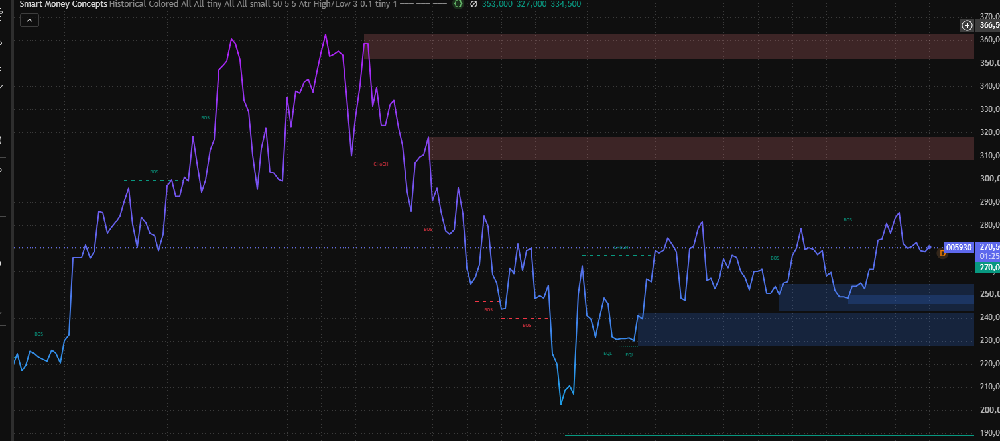
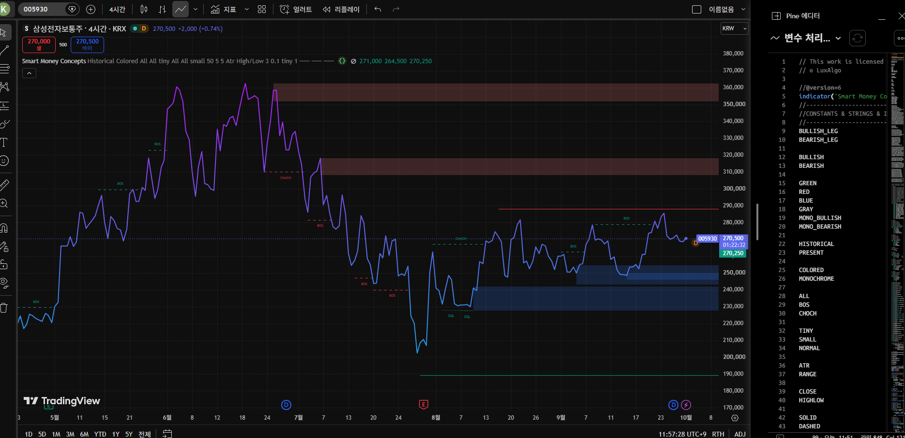

# 오더 블록과 SMC 차트 읽기: 삼성전자 4시간봉 사례

이 문서는 삼성전자 보통주(005930) **4시간봉 캡처 한 장**을 예로 들어 Smart Money Concepts(SMC)의 구조 신호와 오더 블록을 읽는 순서를 설명합니다. 먼저 차트만 확대한 화면을 보고, 뒤에서 원본 화면의 종목·시간봉·지표 정보를 확인합니다.

> **캡처 해석의 범위**: 아래 약 270,500원과 각 가격 구역은 이미지에 표시된 과거 시점의 값입니다. 현재 시세·지지·저항을 뜻하지 않습니다. 색상과 라벨은 지표 설정 및 시간봉에 따라 달라지며, 어느 구역도 기관의 실제 주문 내역이나 향후 가격을 증명하지 않습니다.

## 1. 차트 확대 화면에서 무엇을 볼까?

*그림 1. 차트 부분만 확대한 화면. 오른쪽 끝의 약 270,500원과 아래 가격대는 캡처 당시 표시값이다. 이미지의 눈금으로 읽은 구역 경계는 근사치다.*

차트는 **왼쪽에서 오른쪽으로** 읽습니다. 과거 상승 구간의 `BOS`, 하락 전환 부근의 `CHoCH`, 하락 후 비슷한 저점의 `EQL`, 최근 상승 구간의 `BOS` 순서입니다. 한 라벨만 떼어 미래 방향을 단정하지 말고, 라벨이 나온 *앞뒤 가격 움직임*을 함께 봅니다.

| 화면의 표식 | 이 이미지에서 보이는 위치 | 읽는 방법 |
|---|---|---|
| 초록·청록 `BOS` | 왼쪽 상승 구간과 오른쪽 최근 반등 구간 | 기존 방향의 고점·저점 구조가 돌파되었다는 지표 표시. 이후에도 같은 방향이 이어졌는지는 별도로 확인한다. |
| 빨간 `CHoCH`와 `BOS` | 큰 고점 이후 하락이 시작된 중간 구간 | 상승 구조가 흔들린 뒤 하락 방향의 구조 돌파가 이어진 장면이다. `CHoCH` 하나만으로 추세 전환이 확정되지는 않는다. |
| 청록 `EQL` | 약 225,000~230,000원 부근의 비슷한 저점 두 곳 | 비슷한 저점이 반복된 구간. 저점 아래로 잠시 내려갔다고 항상 반등하는 것은 아니다. |
| 파란 구역 | 약 230,000~240,000원, 245,000~255,000원 | 지표가 표시한 상승 오더 블록 후보. 다시 닿을 때 지지 여부를 관찰할 구역이며, 자동 매수 신호는 아니다. |
| 빨간 구역 | 약 310,000~320,000원, 350,000~360,000원 | 지표가 표시한 하락 오더 블록 후보. 가격이 접근하면 반응을 관찰할 구역이며, 반드시 하락한다는 뜻은 아니다. |

오른쪽의 약 **287,000~290,000원** 선은 이 캡처에서 보이는 가까운 이전 고점·수평선입니다. 화면 끝의 약 270,500원과 파란·빨간 구역의 거리를 비교할 때 참고할 수 있지만, 가격 목표를 제시하는 선으로 읽지 않습니다. 색상만으로 박스 종류를 일반화하지 말고 이 지표의 라벨과 설정을 함께 확인합니다.

## 2. 오더 블록은 무엇인가?

SMC에서 **오더 블록(Order Block, OB)**은 강한 상승이나 하락이 시작되기 직전의 반대 방향 캔들 또는 그 연속 구간을 가격대로 표시한 것입니다. 예를 들어 강한 상승 직전 마지막 하락 캔들 구간을 *상승 오더 블록 후보*, 강한 하락 직전 마지막 상승 캔들 구간을 *하락 오더 블록 후보*로 봅니다. 후보를 고를 때는 이후 가격이 빠르게 이동했는지, 이전 고점·저점 구조를 돌파했는지를 함께 확인합니다. [LuxAlgo의 오더 블록 설명](https://www.luxalgo.com/library/concept/bullish-bearish-order-block/)

쉽게 말해 **가격이 강하게 움직이기 시작한 출발 구역을 다시 표시한 것**입니다. 나중에 가격이 돌아오면 그곳에서 반응할 *가능성*을 살펴볼 수 있습니다. 박스가 보인다는 사실만으로 기관의 매수·매도 주문이 남아 있거나 지지·저항이 반드시 작동한다고 확인할 수는 없습니다. 실제로 구역을 그대로 통과하는 경우도 있습니다. [LuxAlgo의 오더 블록 설명](https://www.luxalgo.com/library/concept/bullish-bearish-order-block/)

오더 블록을 읽을 때는 다음 순서를 고정하면 해석이 선명해집니다.

1. **방향**: 어느 방향의 구조 돌파(`BOS`)나 변화 경고(`CHoCH`) 뒤에 생겼는가?
2. **출발**: 어떤 캔들·가격 범위에서 강한 움직임이 시작되었는가?
3. **재방문**: 이후 가격이 구역으로 돌아왔을 때 머무르는가, 반등·반락하는가, 그대로 통과하는가?
4. **무효화**: 구역을 종가 기준으로 벗어나면 기존 해석을 어떻게 바꿀 것인가? 캔들 몸통·꼬리 중 어느 범위를 박스로 쓸지도 미리 정한다.

## 3. 원본 화면에서 맥락 확인하기

*그림 2. 같은 차트의 전체 화면. 상단에서 종목 `005930`, `4시간` 시간봉, `Smart Money Concepts` 지표를 확인할 수 있다. 오른쪽 Pine 편집기는 차트 가격 신호가 아니다.*

그림 1은 그림 2의 **차트 부분을 확대한 것**입니다. 서로 다른 날짜의 독립 사례처럼 비교하지 않습니다. 4시간봉의 표식은 일봉·주봉에서 다시 계산하면 위치나 의미가 달라질 수 있습니다. 또한 현재 화면에 보이는 박스·라벨은 지표의 `Historical` 모드와 표시 개수·판정 설정에 영향을 받습니다. [LuxAlgo SMC 지표 안내](https://www.luxalgo.com/library/indicator/smart-money-concepts-smc/)

## 4. 이 캡처를 조건별로 해석하면

아래는 **캡처를 읽는 연습용 시나리오**입니다. 이 가격을 현재 거래의 진입가·목표가·손절가로 사용하지 않습니다.

- **가격이 가까운 이전 고점으로 향할 때**: 약 287,000~290,000원 부근에서 돌파 후 유지되는지, 잠시 넘었다가 다시 내려오는지 구분합니다. 잠깐의 돌파만으로 새로운 상승 `BOS`가 확정되었다고 보지 않습니다.
- **가격이 아래 파란 구역으로 돌아올 때**: 약 245,000~255,000원 구역에서 반응이 있는지 살펴봅니다. 구역을 통과하면 더 아래의 약 230,000~240,000원 구역과 과거 저점 구조를 다시 확인합니다. 반등을 전제하지 않습니다.
- **가격이 위 빨간 구역에 접근할 때**: 약 310,000~320,000원과 그 위의 약 350,000~360,000원에서 실제 가격 반응을 관찰합니다. 박스 자체는 매도 체결이나 반락의 증거가 아닙니다.

이 시나리오를 검증하려면 캡처 이후의 봉을 같은 시간봉에서 이어 붙이고, **봉 마감 기준의 돌파·구역 재방문·무효화**를 미리 정한 규칙으로 기록해야 합니다. 거래량, 실적·공시, 시장 전체 흐름, 거래비용도 별도로 살펴야 합니다. 캡처 한 장만으로 승률이나 기대수익을 계산할 수 없습니다.

## 5. 화면의 용어와 함께 알아둘 용어

| 용어 | 뜻 | 이 캡처에서의 주의점 |
|---|---|---|
| `BOS` (Break of Structure) | 기존 추세 방향으로 의미 있는 이전 고점 또는 저점을 돌파했다는 구조 표시 | 추세 지속의 *단서*이며 이후 가격 확인이 필요하다. |
| `CHoCH` (Change of Character) | 기존 추세와 반대 방향의 구조가 처음 깨졌다는 경고 | 전환 가능성을 알릴 뿐, 반전 확정 신호는 아니다. |
| `EQL` / `EQH` (Equal Lows / Highs) | 서로 가까운 저점 / 고점 | 그림에는 `EQL`이 보인다. 비슷한 가격에 주문이 몰릴 가능성을 보는 표시이지 실제 손절 주문량을 보여 주지 않는다. |
| 상승·하락 `OB` | 강한 움직임의 출발 구역을 표시한 오더 블록 후보 | 파란·빨간 박스가 재방문 때 항상 작동하는 것은 아니다. |

위 네 가지는 그림에서 직접 확인할 수 있습니다. 아래는 원래 초안에 있었지만 **이 이미지에서 명확히 표시되지는 않은 연관 용어**입니다.

- **FVG (Fair Value Gap)**: 빠른 움직임으로 만들어진 세 캔들 사이의 가격 불균형 구간입니다. 가격이 나중에 반드시 되돌아와 채우는 것은 아닙니다. [LuxAlgo FVG 설명](https://www.luxalgo.com/library/concept/fair-value-gap/)
- **유동성 스윕(Liquidity Sweep)**: 이전 고점·저점을 잠시 넘었다가 되돌아오는 움직임을 가리킵니다. 차트 모양으로 주문의 실제 목적을 알 수는 없습니다.
- **프리미엄·디스카운트 구역**: 선택한 가격 범위의 중간값을 기준으로 위쪽·아래쪽을 나눈 상대적 위치입니다. 기업의 적정 가치평가와는 다릅니다.
- **POI (Point of Interest)**: 관찰 대상으로 고른 가격대라는 일반적인 이름입니다. 오더 블록·FVG·전고점 등 근거를 함께 적어야 의미가 있습니다.
- **MSB/MSS (Market Structure Break/Shift)**: 저자와 지표마다 `CHoCH`와 비슷하거나 다른 뜻으로 씁니다. 이 문서에서는 화면에 실제 표시된 `BOS`·`CHoCH`를 우선 사용합니다. [LuxAlgo CHoCH 설명](https://www.luxalgo.com/library/concept/change-of-character/)
- **손익비(R:R)**: 미리 정한 예상 손실 대비 예상 이익의 비율입니다. 예를 들어 손실 허용액 1만 원, 목표 이익 2만 원이면 1:2입니다. 이 캡처만으로 손익비를 정할 수는 없습니다.

## 6. 한눈에 보는 읽기 순서

**종목·시간봉 확인 → 왼쪽부터 구조(`BOS`·`CHoCH`) 읽기 → 비슷한 고점·저점(`EQL`) 확인 → 오더 블록 후보 표시 → 이후 봉에서 구역의 반응·무효화 검증.** 이 순서를 지키면 박스 하나를 근거로 결론을 앞당기는 오류를 줄일 수 있습니다.

### 참고 자료

- [LuxAlgo, Smart Money Concepts (SMC) 지표](https://www.luxalgo.com/library/indicator/smart-money-concepts-smc/)
- [LuxAlgo, 상승·하락 오더 블록 정의와 한계](https://www.luxalgo.com/library/concept/bullish-bearish-order-block/)
- [LuxAlgo, BOS와 CHoCH 개념](https://www.luxalgo.com/library/concept/break-of-structure/) · [CHoCH 상세](https://www.luxalgo.com/library/concept/change-of-character/)

> 이 문서는 차트 해석 학습용입니다. 캡처의 가격대는 현재 시세가 아니며 특정 종목의 매수·매도를 권유하지 않습니다.

---

### 해석의 예시

차트에 표시된 288,900원 부근의 빨간색 가로선(저항선)은 최근 발생한 전고점이자 세력의 매도 수급이 시작된 핵심 구간입니다.

결론부터 말씀드리면, "당분간 무조건 못 뚫는다"라기보다는 "강력한 거래량(수급) 없이 첫 번째 시도만에 한 번에 넘어서기는 매우 어려운 높은 벽"으로 해석하는 것이 기술적으로 정확합니다.

그 원인과 향후 대응 시나리오는 다음과 같습니다.

---

### 1. 288,900원 라인이 강력한 저항인 이유

1. **하락 파동의 출발점:**
* 해당 라인은 최근 상승 흐름이 꺾이고 다시 하락 조정이 시작되었던 **단기 고점**입니다.

2. **상단 Bearish Order Block(매도 구역)의 관문:**
* 288,900원 바로 위쪽(310,000~320,000)에는 세력의 대량 매도 물량이 쌓여있는 붉은색 박스(Order Block)가 버티고 있습니다.

3. **심리적 물량 매물대:**
* 지난번 고점에서 물린 개인 투자자들의 본전 매도 물량(손절 및 익절 수급)이 집중되어 있는 구간입니다.

---

### 2. 돌파 여부를 결정짓는 2가지 시나리오

#### 🔴 시나리오 A: 돌파 실패 후 다시 눌림 (확률 높음)

* **상황:** 주가가 288,900원 부근까지 상승하더라도 **거래량이 터지지 않거나**, 상단 저항을 맞고 윗꼬리를 달며 밀리는 경우.
* **흐름:** 288,900원 맞고 재하락 ➔ 하단의 푸른색 매수 구역(250,000~260,000)으로 내려와 다시 쌍바닥 매집 과정을 거침.

#### 🟢 시나리오 B: 강한 수급(거래량)으로 돌파 (돌파 성공 조건)

* **상황:** 기관·외국인의 대량 수급과 함께 **거래량이 급증하면서 장대양봉**으로 288,900원을 위로 뚫어내는 경우.
* **흐름:** 288,900원이 기존 '저항선'에서 '강력한 지지선'으로 역할이 변경(Flip)되며, 다음 매도 구역인 **310,000원 선까지 2차 상승 파동**이 열리게 됩니다.

---

### 3. 실전 매매 대응 팁

* **신규 진입자:** 288,900원 바로 밑에서 매수하는 것은 저항선 바로 앞이라 리스크가 큽니다. **주가가 하단 푸른색 구역(250,000~260,000)으로 다시 눌려줄 때 진입**하거나, 아예 **288,900원을 확실히 뚫고 안착(눌림목 지지)할 때 따라 들어가는 것**이 안전합니다.

* **기존 보유자:** 주가가 288,900원에 도달할 때 거래량이 터지지 않는다면 일부 비중을 축소(차익 실현)하여 수익을 확정 짓고, 돌파 여부를 관망하는 전략이 유용합니다.